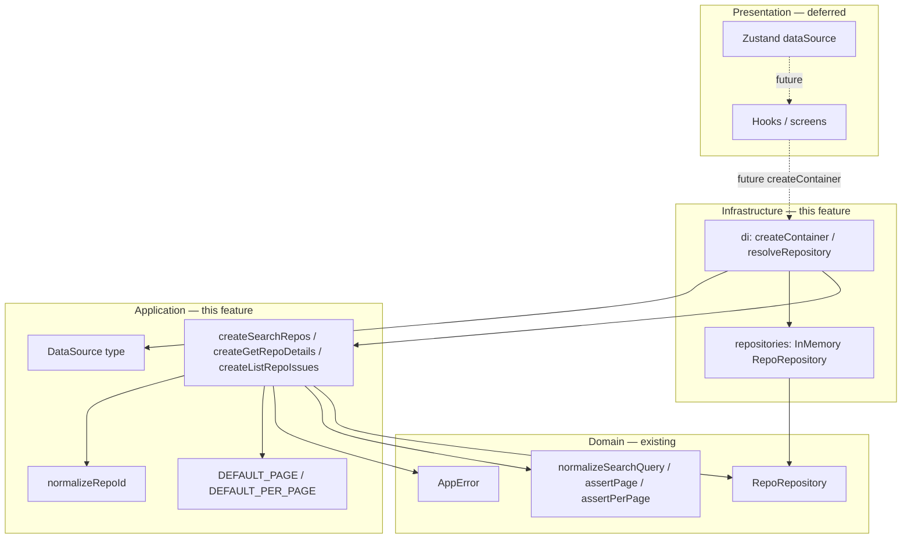

# Application Layer Design

**Spec**: `.specs/features/application-layer/spec.md`  
**Context**: `.specs/features/application-layer/context.md`  
**Status**: Approved (Approach A)

---

## Approach exploration (Large)

| Approach | Summary | Pros | Cons |
| -------- | ------- | ---- | ---- |
| **A — Evolve in place (recommended)** | Refatorar use cases existentes → factories funcionais + helpers; mover Fake para `infrastructure/repositories/`; criar `infrastructure/di` + barrels | Reusa testes/fixtures; alinha context A–D e AD-001/002/019; diff contido | Rename quebra imports atuais do barrel (mecânico) |
| B — Manter `{ execute }` + DI só adapta | Menos churn nos testes | Contradiz context (Functional Core / `container.searchRepos(input)`) | Spec APP-01 falha |
| C — Application Service OO monolítico | Um serviço com três métodos | Diverge do padrão factory + porta já usado | Acopla casos; pior para testar em isolamento |

**Recommendation: A.** Mesmo escopo, menor risco, decisions do context já apontam para factories funcionais + composition root híbrido.

---

## Architecture Overview

**Application** = orquestração pura (validação via domínio + defaults + chamada à porta).  
**Infrastructure** = Fake (adapter) + composition root (`resolveRepository` + `createContainer`).  
**Presentation** (fora) = lê `dataSource` no store e chama `createContainer` (fatia seguinte).



**Dependency Rule:** `application` → `domain` only (produção). `infrastructure` → `application` + `domain`. `application` **não** importa `infrastructure` (testes podem).

---

## Code Reuse Analysis

### Existing Components to Leverage

| Component | Location | How to Use |
| --- | --- | --- |
| Use case stubs | `src/application/use-cases/*.ts` | Refatorar para helpers + retorno função; rename factories |
| In-memory fake | `src/application/fakes/in-memory-repo-repository.ts` | Mover para `src/infrastructure/repositories/`; manter API `createInMemoryRepoRepository` |
| Domain helpers | `src/domain/validation/*` | Chamar de search/list use cases |
| `DataSource` | `src/application/types/data-source.ts` | Input de `createContainer` / `resolveRepository` |
| Isolation scan pattern | `src/domain/__tests__/isolation.test.ts` | Clonar para `src/application/__tests__/isolation.test.ts` (+ ban `@/infrastructure` em prod) |
| UC tests + fixtures | `src/application/use-cases/__tests__/*` | Atualizar imports Fake + API sem `.execute` + novos ACs |

### Integration Points

| System | Integration Method |
| --- | --- |
| `@/domain` | Use cases + Fake importam porta/helpers/errors |
| `@/application` barrel | Factories + tipos I/O + DataSource; **sem** DI/Fake |
| `@/infrastructure` barrel | `createContainer`, tipos, Fake |
| Presentation / Zustand | **Não** nesta fatia — só contrato `createContainer({ dataSource })` |
| Jest | Suites colocadas: use-cases, di, isolation, barrel smokes |

---

## Components

### Pagination defaults

- **Purpose**: Defaults de application (domínio não define).
- **Location**: `src/application/constants/pagination.ts`
- **Interfaces**:
  - `DEFAULT_PAGE = 1`
  - `DEFAULT_PER_PAGE = 20`
- **Dependencies**: none
- **Reuses**: enunciado `per_page=20`; DOM-06 (default fora do domínio)

### `normalizeRepoId`

- **Purpose**: Trim + rejeitar vazio com `invalid_input` (sem helper de id no domínio).
- **Location**: `src/application/validation/repo-id.ts`
- **Interfaces**:
  - `normalizeRepoId(raw: string): string` — throws `AppError` `invalid_input` se trim vazio
- **Dependencies**: `createAppError` from `@/domain`
- **Reuses**: mesmo espírito de `normalizeSearchQuery`

### Use case factories (functional)

- **Purpose**: Orquestrar validação + porta; retornar função executável.
- **Location**:
  - `src/application/use-cases/search-repos.ts` → `createSearchRepos`
  - `src/application/use-cases/get-repo-details.ts` → `createGetRepoDetails`
  - `src/application/use-cases/list-repo-issues.ts` → `createListRepoIssues`
- **Interfaces** (ver Data Models):
  - `createSearchRepos(repo: RepoRepository): SearchRepos`
  - `createGetRepoDetails(repo: RepoRepository): GetRepoDetails`
  - `createListRepoIssues(repo: RepoRepository): ListRepoIssues`
- **Flow (search)**: `normalizeSearchQuery` → `page = input.page ?? DEFAULT_PAGE` → `perPage = input.perPage ?? DEFAULT_PER_PAGE` → `assertPage(page)` → `assertPerPage(perPage)` → `repo.search({ query, page, perPage })`
- **Flow (details)**: `normalizeRepoId` → `repo.getById(repoId)`
- **Flow (issues)**: `normalizeRepoId` → defaults + asserts → `repo.listIssues(...)`
- **Dependencies**: `@/domain` only (+ constants/validation locais)
- **Reuses**: factories atuais (sem `{ execute }`)

### In-memory Fake repository

- **Purpose**: Adapter provisório de `RepoRepository` para testes e runtime até HTTP.
- **Location**: `src/infrastructure/repositories/in-memory-repo-repository.ts`
- **Interfaces**: `createInMemoryRepoRepository(repos?, issuesByRepoId?): RepoRepository` (igual à API atual)
- **Dependencies**: `@/domain` (`createAppError`, entity types)
- **Reuses**: implementação atual em `application/fakes` (mover + apagar pasta antiga)

### `resolveRepository`

- **Purpose**: Único branch `DataSource` → porta (AD-002); ambas as rotas → Fake por enquanto.
- **Location**: `src/infrastructure/di/resolve-repository.ts`
- **Interfaces**:
  - `resolveRepository(dataSource: DataSource): RepoRepository`
  - Implementação: object map / branches `github` | `gitlab` ambos `return createInMemoryRepoRepository()` (nova instância por chamada; **sem** `switch` espalhado fora daqui)
- **Dependencies**: `DataSource` from `@/application`; Fake from repositories
- **Reuses**: AD-013 spirit (map tipado preferível a switch solto) — `Record<DataSource, () => RepoRepository>` ou equivalente

### `createContainer`

- **Purpose**: Composition root imutável: resolve repo e parcializa use cases.
- **Location**: `src/infrastructure/di/create-container.ts`
- **Interfaces**:
  - `createContainer(deps: CreateContainerDeps): AppContainer`
  - `CreateContainerDeps = { dataSource: DataSource; repository?: RepoRepository }` — override opcional para testes
  - Wiring: `const repository = deps.repository ?? resolveRepository(deps.dataSource)` then bind factories
- **Dependencies**: application factories + `resolveRepository`; **não** Zustand
- **Reuses**: n/a (novo)

### Barrels

- **`src/application/index.ts`**: `DataSource`, `isDataSource`, três factories, input types, function types (`SearchRepos`, …). Sem DI/Fake.
- **`src/infrastructure/index.ts`**: `createContainer`, `CreateContainerDeps`, `AppContainer`, `createInMemoryRepoRepository`. (`resolveRepository` pode ficar interno ou exportado se útil a testes — preferência: **exportar** para APP-09 testável sem deep import frágil.)

### Isolation / barrel tests

- **Location**:
  - `src/application/__tests__/isolation.test.ts` (APP-07)
  - `src/infrastructure/di/__tests__/no-zustand.test.ts` ou assert dentro da suite DI (APP-12)
  - `src/application/__tests__/public-api.test.ts` (APP-13, APP-15)
  - `src/infrastructure/__tests__/public-api.test.ts` (APP-14)
  - `src/infrastructure/di/__tests__/create-container.test.ts` + `resolve-repository.test.ts` (APP-09..11)

---

## Data Models

### Application use-case types

```typescript
// inputs — page/perPage optional at application boundary
type SearchReposInput = { query: string; page?: number; perPage?: number };
type GetRepoDetailsInput = { repoId: string };
type ListRepoIssuesInput = { repoId: string; page?: number; perPage?: number };

type SearchRepos = (input: SearchReposInput) => Promise<PaginatedResult<Repo>>;
type GetRepoDetails = (input: GetRepoDetailsInput) => Promise<Repo>;
type ListRepoIssues = (input: ListRepoIssuesInput) => Promise<PaginatedResult<Issue>>;
```

**Note:** Domain port inputs still require `page: number`; use cases always pass resolved defaults.

### Container

```typescript
type CreateContainerDeps = {
  dataSource: DataSource;
  repository?: RepoRepository; // test override
};

type AppContainer = {
  searchRepos: SearchRepos;
  getRepoDetails: GetRepoDetails;
  listRepoIssues: ListRepoIssues;
};
```

**Relationships:** `AppContainer` functions close over one `RepoRepository` instance chosen at creation time.

---

## Error Handling Strategy

| Error Scenario | Handling | User Impact |
| -------------- | -------- | ----------- |
| Query vazia/whitespace | `normalizeSearchQuery` → `empty_query` | UI (depois) mapeia code → copy |
| page/perPage inválidos | `assertPage` / `assertPerPage` → `invalid_input` | Idem |
| repoId vazio | `normalizeRepoId` → `invalid_input` | Idem |
| Repo inexistente no Fake | `getById` → `not_found` | Distinto de input inválido |
| Falhas futuras HTTP | Porta rejeita `AppError`; use case propaga | Fora desta fatia |

---

## Risks & Concerns

| Concern | Location | Impact | Mitigation |
| ------- | -------- | ------ | ---------- |
| Duplicação trim/empty ainda nos UC | `src/application/use-cases/search-repos.ts` | Drift vs domínio | Task: adotar helpers; testes assertam codes |
| Fake sob application viola Dependency Rule | `src/application/fakes/*` | Application “conhece” adapter | Mover para infrastructure; APP-08/16 |
| Rename factories quebra consumers | `src/application/index.ts` | Compile break | Grep + atualizar barrel/testes nesta feature (sem presentation wired ainda) |
| `resolveRepository` ambos → Fake | di | Falso senso de dual-provider | Documentar; próxima feature só troca returns; testes travam branches existentes |
| Application importar infra em prod | — | Ciclo / regra quebrada | Isolation test: ban `@/infrastructure` em sources de application (excl. tests) |
| Testes UC fracos (só happy path details/issues) | `get-repo-details-and-issues.test.ts` | Gaps APP-05/06 | Expandir casos empty repoId, defaults, invalid page |

---

## Tech Decisions (non-obvious)

| Decision | Choice | Rationale |
| -------- | ------ | --------- |
| Fake path | `src/infrastructure/repositories/in-memory-repo-repository.ts` | Espelha futuros `github`/`gitlab` repos |
| Container deps override | `repository?:` opcional | Testes injetam Fake seeded sem passar por resolve |
| Export `resolveRepository` | Sim, no barrel infrastructure | APP-09 testável; Presentation normalmente só usa `createContainer` |
| Prefer map tipado em resolve | `Record<DataSource, () => RepoRepository>` | AD-013; exaustivo no tipo |
| Rename curto | `createSearchRepos` / `createGetRepoDetails` / `createListRepoIssues` | Context Functional Core; tipos função sem sufixo `UseCase` |
| normalizeRepoId na application | Sim, módulo `validation/repo-id.ts` | Domínio não tem helper de id (context domain) |

> **Project-level:** Append **AD-020** — composition root em `infrastructure/di`; use cases como factories funcionais; Fake/adapters de porta na infrastructure.

---

## Requirement mapping (design → IDs)

| ID | Design component |
| -- | ---------------- |
| APP-01..06 | Use case factories + constants + normalizeRepoId |
| APP-07 | application isolation test |
| APP-08 | Fake move |
| APP-09..12 | resolveRepository + createContainer + di constraints |
| APP-13..16 | Barrels + test imports |

**Coverage after design:** 16/16 mapped to components (tasks TBD)
