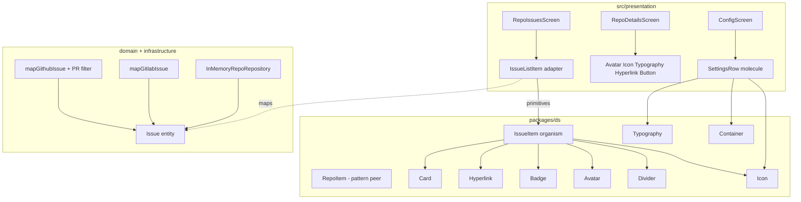

# Details / Issues / Config UI Design

**Spec**: `.specs/features/details-issues-config-ui/spec.md`  
**Context**: `.specs/features/details-issues-config-ui/context.md`  
**Status**: Approved (user: confirm + Design + Tasks)

---

## Architecture Overview

**Chosen approach — layered polish without new app patterns**

| Approach | Summary | Verdict |
| -------- | ------- | ------- |
| **A — Screen Details + DS IssueItem + SettingsRow** | Details layout stays in presentation; Issue list mirrors `RepoItem`; Config uses a reusable settings molecule; domain/ACL gain shared Issue fields | **Chosen** — matches locked context |
| B — `RepoDetails` organism in DS | Extract details chrome to `packages/ds` | Rejected — user |
| C — Config-only composition (no SettingsRow) | Inline Container rows on Config | Rejected — agent discretion prefers molecule (AD-009 / DIC-10) |



**Dependency rule (unchanged — AD-001 / AD-029)**

| Layer | May import |
| ----- | ---------- |
| `packages/ds` | React, RN, styled-components, vector-icons, `@ds/*` only |
| `IssueListItem` | `@/domain` (`Issue`), `@ds` IssueItem |
| Screens | DS + presentation adapters; no provider `if (github)` branches |

---

## Code Reuse Analysis

### Existing Components to Leverage

| Component | Location | How to Use |
| --------- | -------- | ---------- |
| `RepoItem` layout | `packages/ds/organisms/RepoItem` | Visual/composition template for `IssueItem` (Card → body → Divider → footer stats) |
| `Stat` / `StatsRow` pattern | `RepoItem/styles.tsx` | Mirror locally in `IssueItem/styles.tsx` (do not cross-import RepoItem styles) |
| Card, Badge, Avatar, Icon, Typography, Divider, Hyperlink | `packages/ds` | IssueItem + Details metrics + SettingsRow |
| `formatRelativeDate` | `packages/ds/utils` | IssueItem relative `updatedAt` |
| FlatList molecule | `packages/ds/molecules/FlatList` | Already on `RepoIssuesScreen` — keep |
| `StackBackHeader` / `Header` | presentation / DS | Unchanged chrome |
| Session store `dataSource` / `toggleMode` | `src/stores` | Config read-only source + theme trailing |
| Mapper / Fake / MSW patterns | `src/infrastructure/**`, `src/test/msw` | Extend DTOs + fixtures |

### Integration Points

| System | Integration Method |
| ------ | ------------------ |
| `RepoDetailsScreen` | Restyle in place; compose atoms/molecules; preserve `testID`s |
| `IssueListItem` → `IssueItem` | Thin adapter; relative date `now?` for tests |
| `ConfigScreen` | Three `SettingsRow`s |
| GitHub `listIssues` | Filter `pull_request` before map |
| Storybook | `DS/Molecules/SettingsRow`, `DS/Organisms/IssueItem` |

---

## Components

### Domain `Issue` (enrichment)

- **Purpose**: Shared issue contract with list-ready metadata from both providers.
- **Location**: `src/domain/entities/issue.ts`
- **Interfaces**:

```typescript
export type IssueState = 'open' | 'closed';

export type Issue = {
  id: string;
  number: number;
  title: string;
  authorName: string;
  authorAvatarUrl?: string;
  labels: IssueLabel[];
  createdAt: string;
  updatedAt: string;
  state: IssueState;
  comments: number;
  htmlUrl: string;
};
```

- **Dependencies**: none (Functional Core — AD-019)
- **Reuses**: existing `IssueLabel`

### GitHub / GitLab ACL

- **Purpose**: Map new DTO fields; normalize GitLab `opened` → `open`; drop GitHub PRs.
- **Location**: `src/infrastructure/github|gitlab/{types,mappers,create-*-repo-repository}.ts`
- **Interfaces**:
  - `GithubIssueDto` adds `state`, `comments`, `updated_at`, optional `pull_request?: unknown`
  - `GitlabIssueDto` adds `state`, `user_notes_count`, `updated_at`
  - `mapGithubIssue` / `mapGitlabIssue` return full `Issue`
  - `listIssues` (GitHub): `data.filter((dto) => dto.pull_request == null).map(mapGithubIssue)`
- **Reuses**: existing mapper null-helpers + jsonFetch

### SettingsRow (molecule)

- **Purpose**: Reusable settings chrome — icon + title + subtitle + optional trailing.
- **Location**: `packages/ds/molecules/SettingsRow/`
- **Interfaces**:

```typescript
type SettingsRowProps = {
  icon: React.ComponentProps<typeof Icon>['name'];
  title: string;
  subtitle?: string;
  trailing?: React.ReactNode;
  onPress?: () => void;
  style?: StyleProp<ViewStyle>;
  testID?: string;
};
```

- **Behavior**: When `onPress` is set, wrap row in `Pressable` (a11y button); otherwise static `View`. Default `testID="ds-settings-row"`.
- **Dependencies**: Icon, Typography, theme spacing
- **Reuses**: AD-012 folder layout; object maps if variants appear (none required for v1)

### IssueItem (organism)

- **Purpose**: Presentational issue card matching RepoItem density.
- **Location**: `packages/ds/organisms/IssueItem/`
- **Interfaces**:

```typescript
type IssueItemLabel = { label: string; swatch?: string };

type IssueItemProps = {
  number: number;
  title: string;
  titleHref: string;
  authorName: string;
  authorAvatarUrl?: string;
  labels?: IssueItemLabel[];
  state: 'open' | 'closed';
  comments: number;
  updatedAt: string;
  /** Injected for deterministic relative dates in tests/stories. */
  now?: Date;
  style?: StyleProp<ViewStyle>;
  testID?: string;
};
```

- **Layout**:
  1. **Body**: Hyperlink title (`titleHref`) → meta row `#number` + state Badge (`Aberta` / `Fechada`, muted swatch optional) → labels Badges (omit if empty) → author Avatar + name + relative `updatedAt`
  2. **Divider** horizontal
  3. **Footer**: comments stat — Icon `chatbubble-outline` + count (show `0`)
- **Dependencies**: Card, Hyperlink, Badge, Avatar, Typography, Divider, Icon, `formatRelativeDate`
- **Reuses**: RepoItem structure; mirror Stat styles locally

### IssueListItem (adapter)

- **Purpose**: Map `Issue` → `IssueItem` props.
- **Location**: `src/presentation/screens/search/IssueListItem.tsx`
- **Interfaces**: `{ issue: Issue; now?: Date }` (unchanged public API)
- **Mapping**: `titleHref: issue.htmlUrl`, `labels: issue.labels.map(l => ({ label: l.name, swatch: l.color }))`, pass `state` / `comments` / `updatedAt` / `now`

### RepoDetailsScreen (restyle)

- **Purpose**: Dense hero + iconed metrics; no DS organism.
- **Location**: `src/presentation/screens/search/RepoDetailsScreen.tsx`
- **Layout**: Avatar `lg` + owner → `fullName` heading → metrics row (`star`, `git-network`, `eye-outline` + counts, a11y labels) → description if trimmed non-empty → Hyperlink → Issues CTA
- **Icons locked**: watchers = `eye-outline` (pairs with outline icons elsewhere)
- **Reuses**: existing hooks/error/loading; preserve `testID`s

### ConfigScreen

- **Purpose**: Settings rows for theme / active source / token placeholder.
- **Location**: `src/presentation/screens/ConfigScreen.tsx`
- **Rows**:
  | Row | Icon | Title | Subtitle | Trailing |
  | --- | ---- | ----- | -------- | -------- |
  | Tema | `moon-outline` / `sunny-outline` by mode | Tema | Alternar entre claro e escuro | Icon button / text Button calling `toggleMode` |
  | Fonte | `git-branch-outline` (or `logo-github` avoided — brand in DataSourceLogo only per AD-011) | Fonte ativa | `GitHub` \| `GitLab` from store | none (read-only) |
  | Token | `key-outline` | Token de API | Em breve — configure seu token com segurança | none |
- **Source label map**: `{ github: 'GitHub', gitlab: 'GitLab' }` object map (AD-013)
- **Must not**: `toggleDataSource`, `DataSourceLogo`, SecureStore/TextInput/`setToken`

---

## Data Models

See Domain `Issue` above. No new persistence. Session `dataSource` / `mode` unchanged (AD-018 / AD-024).

---

## Error Handling Strategy

| Error Scenario | Handling | User Impact |
| -------------- | -------- | ----------- |
| Details/Issues load failure | Existing `mapAppErrorToMessage` + retry | Unchanged |
| GitHub PR-only page | Filter → possibly empty page; `hasNextPage` still from Link headers | Empty or shorter page; pagination continues |
| Missing optional avatar/labels | Existing fallbacks (initials / omit badges) | Unchanged |
| Config token | Placeholder only | No error path |

---

## Risks & Concerns

| Concern | Location | Impact | Mitigation |
| ------- | -------- | ------ | ---------- |
| Issue type change breaks many fixtures | `**/__tests__/**`, MSW JSON, Fake seeds | Compile/test red until all literals updated | Single foundation task updates domain + ACL + Fake + fixtures together |
| GitHub issues endpoint mixes PRs | `create-github-repo-repository.ts` listIssues | PRs shown as issues | Filter `pull_request == null` before map (DIC-06) |
| Duplicating Stat chrome Details vs RepoItem | Details screen | Visual drift | Same icon names + caption typography; accept local composition (no shared organism) |
| AD-011 brand logos | Config source row | Accidentally importing DataSourceLogo | Text label only; icon = generic `git-branch-outline` |
| IssueListItem tests assert `createdAt` relative | `IssueListItem.test.tsx` | Fail after switching to `updatedAt` | Update expectations to `updatedAt` |

---

## Tech Decisions (non-obvious)

| Decision | Choice | Rationale |
| -------- | ------ | --------- |
| Watchers icon | `eye-outline` | Outline family consistency with Config theme icons |
| State UI | Badge text `Aberta` / `Fechada` | PT-BR UI; distinguishable without color-only |
| Relative date prop | `updatedAt` + optional `now` inside IssueItem | Matches current testability pattern; uses DS helper |
| Comments icon | `chatbubble-outline` | Clear affordance; Ionicons via Icon atom |
| PR filter locus | GitHub repository `listIssues`, not mapper | Mapper stays pure DTO→Issue; filter is list semantics |
| SettingsRow | Ship as molecule (DIC-10 → implement) | Three rows + future prefs; AD-009 |
| Config source icon | `git-branch-outline` | Avoid brand SVG import rules (AD-011) |
| Details metrics | Compose on screen | User forbid RepoDetails organism |

> No new project-level AD — conforms to AD-009/012/013/019/028/029.
