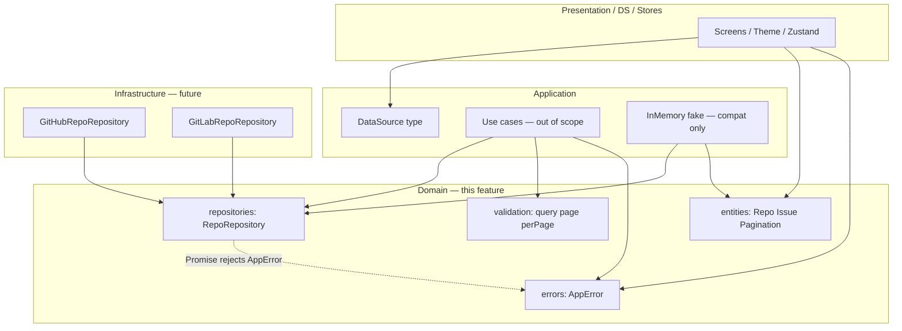

# Domain Layer Design

**Spec**: `.specs/features/domain-layer/spec.md`  
**Context**: `.specs/features/domain-layer/context.md`  
**Status**: Approved (Approach A)

---

## Approach exploration (Large)

| Approach | Summary | Pros | Cons |
| -------- | ------- | ---- | ---- |
| **A — Evolve in place (recommended)** | Refatorar `src/domain/**` existente; mover `DataSource` para `src/application/types/`; helpers novos em `domain/validation/` | Reusa estrutura AD-001; diff pequeno; consumers já importam `@/domain` | Precisa de compat mínima em application/fake/tests |
| B — Greenfield DDD folders | Aggregates / value objects / domain services OO | Mais “DDD textbook” | Contradiz Functional Core (AD-019); reescreve tudo sem ganho no enunciado |
| C — Monorepo package `@searchrepos/domain` | Extrair pacote isolado | Isolamento de dependências via package.json | Overkill para o teste; tooling/Expo alias extra |

**Recommendation: A.** Entrega o mesmo escopo com menor risco e alinha AD-001/AD-019. Confirmar com aprovação deste design.

---

## Architecture Overview

Núcleo **Functional Core**: types anêmicos + funções puras. A porta `RepoRepository` é o único contrato de I/O do domínio. Provedores (`DataSource`) vivem em **application** (config de sessão), nunca no domínio. Presentation/infra dependem do domínio; o domínio não depende de ninguém.



**Dependency Rule:** setas apontam para dentro; `domain` não importa `application` / `presentation` / frameworks.

---

## Code Reuse Analysis

### Existing Components to Leverage

| Component | Location | How to Use |
| --- | --- | --- |
| Entity stubs | `src/domain/entities/*` | Ajustar shapes (drop `source`, `null`→optional, drop `totalCount`) |
| `RepoRepository` | `src/domain/repositories/repo-repository.ts` | Manter API; documentar rejects `AppError` |
| `AppError` | `src/domain/errors/app-error.ts` | Remover `message` param; add `invalid_input` |
| Barrel | `src/domain/index.ts` | Re-export público; **parar** de exportar `DataSource` |
| Application use cases / fake | `src/application/**` | Compat mínima: imports `DataSource`, `createAppError` arity, fixtures sem `source`/`totalCount`, fake throws `AppError` |
| Session / theme / DS logo | stores, theme, tokens, Storybook | Trocar import `@/domain/.../data-source` → `@/application` |

### Integration Points

| System | Integration Method |
| --- | --- |
| `@/application` barrel | Exportar `DataSource` (+ type guard opcional) |
| Jest | Novos testes sob `src/domain/**/__tests__`; atualizar fixtures application |
| ESLint/TS | Alias `@/*` já existe — sem mudança de tooling |

---

## Components

### Entities (`Repo`, `Issue`, `IssueLabel`, `PaginatedResult`)

- **Purpose**: Shapes canônicos compartilhados por application/infra/UI.
- **Location**:
  - `src/domain/entities/repo.ts`
  - `src/domain/entities/issue.ts`
  - `src/domain/entities/pagination.ts`
  - *(delete)* `src/domain/entities/data-source.ts`
- **Interfaces**: ver Data Models
- **Dependencies**: none (inter-entity types only)
- **Reuses**: arquivos atuais

### Port `RepoRepository`

- **Purpose**: Contrato único de busca/detalhe/issues (AD-002).
- **Location**: `src/domain/repositories/repo-repository.ts`
- **Interfaces**:
  - `search(input: SearchReposInput): Promise<PaginatedResult<Repo>>`
  - `getById(repoId: string): Promise<Repo>`
  - `listIssues(input: ListIssuesInput): Promise<PaginatedResult<Issue>>`
  - Inputs: `{ query: string; page: number; perPage?: number }`, `{ repoId: string; page: number; perPage?: number }`
  - **Contract note** (JSDoc): implementações **SHALL** reject com `AppError`; `page` 1-based; `repoId` opaque non-empty string (documentado)
- **Dependencies**: entity types only
- **Reuses**: port atual

### Errors (`AppError`)

- **Purpose**: Taxonomia tipada sem copy de UI.
- **Location**: `src/domain/errors/app-error.ts`
- **Interfaces**:
  - `AppErrorCode = 'rate_limit' | 'network' | 'not_found' | 'empty_query' | 'invalid_input' | 'unknown'`
  - `AppError = Error & { code: AppErrorCode; cause?: unknown }` — **sem** campo de mensagem de domínio
  - `createAppError(code: AppErrorCode, cause?: unknown): AppError` — `Error.message` interno = `code` (stack legível; não é copy de produto)
  - `isAppError(value: unknown): value is AppError`
- **Dependencies**: none
- **Reuses**: factory/guard atuais (assinatura alterada)

### Validation helpers (Functional Core)

- **Purpose**: Normalizar/validar query e bounds de paginação.
- **Location**: `src/domain/validation/`
  - `search-query.ts` — `normalizeSearchQuery(raw: string): string` (trim; throws `empty_query`)
  - `pagination.ts` — `assertPage(page: number): void`, `assertPerPage(perPage: number | undefined): void` (throws `invalid_input`)
  - `index.ts` — re-exports
- **Interfaces**:
  - `normalizeSearchQuery`: empty/whitespace → `createAppError('empty_query')`; else returns trimmed string
  - `assertPage`: `page < 1` → `createAppError('invalid_input')`
  - `assertPerPage`: se `perPage === undefined` → no-op; se `perPage < 1` → `invalid_input`
- **Dependencies**: `createAppError` only
- **Reuses**: n/a (novo)

### Domain barrel

- **Purpose**: API pública estável `@/domain`.
- **Location**: `src/domain/index.ts`
- **Interfaces**: export entities, port types, errors, validation helpers — **not** `DataSource`
- **Dependencies**: domain modules only
- **Reuses**: barrel atual

### `DataSource` (application config type)

- **Purpose**: Union de provedor para sessão/tema/DI — **fora** do domínio (AD-019).
- **Location**: `src/application/types/data-source.ts`
- **Interfaces**:
  - `export type DataSource = 'github' | 'gitlab'`
  - `export function isDataSource(value: unknown): value is DataSource` (mover lógica hoje no store, ou duplicar thin guard aqui e store reusa)
- **Dependencies**: none
- **Reuses**: conteúdo de `domain/entities/data-source.ts`
- **Barrel**: `src/application/index.ts` re-exporta `DataSource` (+ `isDataSource`)

### Isolation + unit tests

- **Purpose**: Provar ACs DOM-08…15 e DOM-12.
- **Location**:
  - `src/domain/errors/__tests__/app-error.test.ts`
  - `src/domain/validation/__tests__/search-query.test.ts`
  - `src/domain/validation/__tests__/pagination.test.ts`
  - `src/domain/__tests__/isolation.test.ts` — scan `src/domain/**/*.ts` (exceto testes) por imports proibidos e por ausência de export/`DataSource` provider literals no barrel
  - `src/domain/__tests__/public-api.test.ts` — smoke exports; `DataSource` not in barrel
- **Forbidden import substrings** (isolation): `react`, `react-native`, `expo`, `axios`, `async-storage`, `@tanstack`, `zustand`, `styled-components`
- **Dependencies**: `fs`/`path` só nos testes de isolamento (Node)
- **Reuses**: padrão Jest do repo

### Consumer compat (mínimo, in-scope)

- Update imports: stores, theme, brand-primary, DataSourceLogo, render.tsx, Storybook preview → `@/application` (or `@/application/types/data-source`)
- Application use cases: `createAppError(code)` / `createAppError(code, cause)` sem message string
- Fixtures: remover `source`; fake: dropar `totalCount`; `getById` throw `createAppError('not_found')`
- **Não** redesenhar use cases (trim/empty podem continuar inline até feature application — ou opcionalmente passar a chamar `normalizeSearchQuery` só se o compile exigir; preferir **só** fix de assinatura/`source`/`totalCount` nesta fatia)

---

## Data Models

### Repo

```typescript
export type Repo = {
  id: string; // opaque
  name: string;
  fullName: string;
  description?: string;
  stars: number;
  forks: number;
  watchers: number;
  language?: string;
  ownerName: string;
  ownerAvatarUrl?: string;
  htmlUrl: string;
  // no source
};
```

### Issue / IssueLabel

```typescript
export type IssueLabel = {
  id: string;
  name: string;
  color?: string;
};

export type Issue = {
  id: string;
  number: number;
  title: string;
  authorName: string;
  authorAvatarUrl?: string;
  labels: IssueLabel[];
  createdAt: string; // opaque date-time string
  htmlUrl: string;
};
```

### PaginatedResult

```typescript
export type PaginatedResult<T> = {
  items: T[];
  page: number; // 1-based
  perPage: number;
  hasNextPage: boolean;
  // no totalCount
};
```

### DataSource (application)

```typescript
export type DataSource = 'github' | 'gitlab';
```

**Relationships**: Port returns `Repo` / `Issue` / `PaginatedResult`; session store holds `DataSource` separately from entities.

---

## Error Handling Strategy

| Error Scenario | Handling | User Impact |
| --- | --- | --- |
| Empty / whitespace query | `normalizeSearchQuery` → `empty_query` | Presentation maps code → copy (future) |
| `page < 1` / `perPage < 1` | asserts → `invalid_input` | Same |
| Port HTTP 429 / offline / 404 | Infra maps to `rate_limit` / `network` / `not_found` | Out of scope; contract ready |
| Unclassified failure | `unknown` | Same |
| Non-AppError to `isAppError` | `false` | Callers branch safely |

---

## Risks & Concerns

| Concern | Location | Impact | Mitigation |
| --- | --- | --- | --- |
| Application use cases still pass `message` to `createAppError` | `src/application/use-cases/*.ts` | Compile break | Compat task: drop message args |
| Fixtures include `source` / `totalCount` | application tests + fake | Compile/runtime shape drift | Strip fields; fake returns new `PaginatedResult` |
| Fake `getById` throws raw `Error` | `in-memory-repo-repository.ts:40` | Violates DOM-11 spirit for tests | Throw `createAppError('not_found')` |
| Many deep imports of `data-source` | stores, DS, Storybook | Missed import → build fail | Grep + barrel `@/application`; update all hit sites |
| Use cases duplicate trim/empty vs new helpers | `search-repos.ts` | Divergência temporária | Aceito (out of scope redesign); follow-up application feature adopts helpers |
| Isolation test false positives | `__tests__` scanning `node_modules` strings | Flaky | Restrict to `from '…'` / `from "…"` import lines under `src/domain` excluding `__tests__` |

---

## Tech Decisions (non-obvious)

| Decision | Choice | Rationale |
| --- | --- | --- |
| Layout helpers | `src/domain/validation/` | Separado de entities; Functional Core claro |
| Helper names | `normalizeSearchQuery`, `assertPage`, `assertPerPage` | Intenção explícita; testável |
| DataSource path | `src/application/types/data-source.ts` + barrel `@/application` | AD-019; discreção do agent |
| `Error.message` | Igual ao `code` | Stack legível sem campo de copy de produto |
| `isDataSource` | Vive junto do tipo em application | Store deixa de definir guard local se reusar |
| Approach | Evolve in place (A) | Menor risco; AD-001 |

> **Project-level:** AD-019 already records DataSource + `invalid_input` + Functional Core — no new AD unless approval changes path.

---

## Requirement mapping (Design)

| ID | Design coverage |
| --- | --- |
| DOM-01…07 | Entities + port models |
| DOM-08…12 | AppError + isolation test |
| DOM-13…15 | validation/* |
| DOM-16 | domain/index.ts |
| DOM-17 | application/types/data-source.ts + consumer imports |

**Status after approval:** move IDs → In Tasks when `tasks.md` is written.
