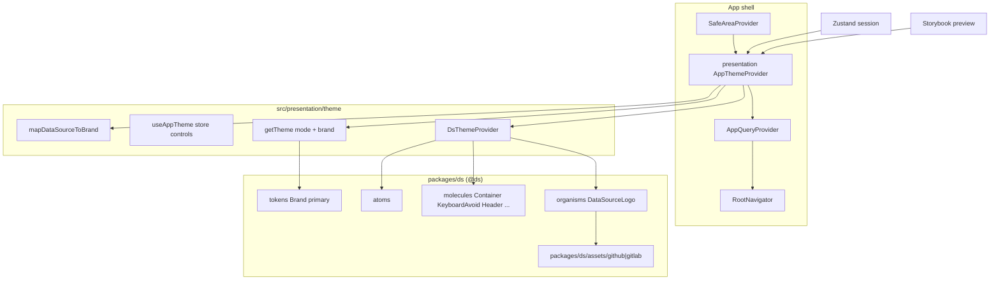

# DS as Lib Design

**Spec**: `.specs/features/ds-as-lib/spec.md`  
**Context**: `.specs/features/ds-as-lib/context.md`  
**Status**: Approved

---

## Approach exploration (Large)

| Approach | Summary | Pros | Cons |
| -------- | ------- | ---- | ---- |
| **A — `packages/ds` + presentation bridge (recommended)** | Move Atomic tree + assets; lib `DsThemeProvider(theme)`; `AppThemeProvider`/`useAppTheme` em presentation; Container layout box + `KeyboardAvoid` | Honra context 1A/2A; Clean Arch; zero shim | Big-bang de imports; testes de gate migram |
| B — Boundaries ESLint em `src/components/ds` | Sem mover pastas; só regras de import | Diff pequeno | Spec DSLIB-01 falha (“fora de src”); lib continua no app |
| C — pnpm workspace package formal | `packages/ds/package.json` + peerDeps | Pacote “de verdade” | Explicitamente out of scope (1A) |

**Recommendation: A.** Context + spec já travam path, pureza e bridge. Este design detalha A.

---

## Architecture Overview



**Dependency rule**

| Layer | May import |
| ----- | ---------- |
| `packages/ds` | React, RN, styled-components, safe-area-context, vector-icons, **own** relative/`@ds` modules only |
| `src/presentation/theme` | `@ds`, `@/stores`, `@/application` (`DataSource`), Expo splash |
| `src/stores` | `@ds` **types only** (`ThemeMode`) — not providers |
| Screens / nav | `@ds` components + `useAppTheme` from presentation |

**Folder target**

```
packages/ds/
  index.ts                 # public barrel
  assets/github|gitlab/    # brand SVGs (moved)
  tokens/                  # + Brand; rename primary map
  theme/
    theme.ts               # getTheme(mode, brand), AppTheme.brand
    DsThemeProvider.tsx    # StyledThemeProvider only
    useTheme.ts            # styled theme hook
    styled.d.ts
    index.ts
  atoms/…                  # unchanged APIs (import paths only)
  molecules/
    Container/             # layout box API rewrite
    KeyboardAvoid/         # NEW
    Header/ InputField/ Card/ …
  organisms/
    DataSourceLogo/        # brand prop; no @/application

src/presentation/theme/
  AppThemeProvider.tsx     # hydrate + splash + getTheme + DsThemeProvider
  useAppTheme.ts           # or colocated export
  map-data-source-to-brand.ts
  index.ts
```

Stories glob → `../packages/ds/**/*.stories.?(ts|tsx|…)`. Titles unchanged (`DS/Atoms|Molecules|Organisms/...`).

---

## Code Reuse Analysis

### Existing Components to Leverage

| Component | Location | How to Use |
| --- | --- | --- |
| Entire DS tree | `src/components/ds/**` | Move → `packages/ds/**`; rewrite imports |
| Brand SVGs | `src/assets/github\|gitlab/**` | Move → `packages/ds/assets/...`; delete empty app dirs if unused |
| `AppThemeProvider` hydrate/splash | `src/components/ds/theme/AppThemeProvider.tsx` | Move logic → `src/presentation/theme/AppThemeProvider.tsx`; drop `StyledThemeProvider` direct use in favor of `DsThemeProvider` |
| `getTheme` / tokens | `theme.ts`, `tokens/**` | Keep values; swap `DataSource` → `Brand` |
| `Container` | `molecules/Container` | Extend API; keep `tone` / `testID` patterns |
| Header `safe` | `molecules/Header` | Unchanged (top boolean); document coexistence with Container `safe` |
| `render` helper | `src/test/render.tsx` | Import bridge from presentation; seed store as today |
| SVG mock | `src/test/__mocks__/svgMock.js` | Reuse; add `@ds` svg mapper in Jest |
| Metro SVG transformer | `metro.config.js` | Keep; project-root `packages/ds` is already watchable |

### Integration Points

| System | Integration Method |
| --- | --- |
| `tsconfig.json` | paths: `"@ds"` → `packages/ds/index.ts`, `"@ds/*"` → `packages/ds/*` |
| `jest.config.ts` | `moduleNameMapper` for `@ds` / `@ds/*` / `@ds/*.svg` **before** `@/` |
| `.rnstorybook/main.ts` | stories glob → `packages/ds` |
| `.rnstorybook/preview.tsx` | import bridge + tokens from presentation/`@ds` |
| `App.tsx` | `AppThemeProvider` from `@/presentation/theme` |
| README Design System section | paths `@ds` / `packages/ds` + bridge note |

---

## Components

### `packages/ds` package root

- **Purpose**: Public UI kit barrel and Atomic Design home outside `src`.
- **Location**: `packages/ds/`
- **Interfaces**:
  - Re-exports: tokens, theme (`getTheme`, `DsThemeProvider`, `useTheme`, types), atoms, molecules, organisms
  - Does **not** export `AppThemeProvider` / `useAppTheme`
- **Dependencies**: peer-like runtime deps already in app (`react`, `react-native`, `styled-components`, …) — no separate package.json
- **Reuses**: Current DS tree layout (AD-009/012)

### `Brand` + `getTheme`

- **Purpose**: Pure theme factory without application types.
- **Location**: `packages/ds/tokens/brand.ts` (or rename `brand-primary.ts`), `packages/ds/theme/theme.ts`
- **Interfaces**:
  - `type Brand = 'github' | 'gitlab'`
  - `primaryByBrand: Record<Brand, Record<ThemeMode, string>>` (rename from `primaryByDataSource`)
  - `getTheme(mode: ThemeMode, brand?: Brand): AppTheme` — default brand `'github'`
  - `AppTheme`: `{ mode, brand, colors, spacing, sizes, … }` — **no** `dataSource`
- **Dependencies**: tokens only
- **Reuses**: Existing hex maps (AD-010)

### `DsThemeProvider`

- **Purpose**: Inject a ready `AppTheme` into styled-components.
- **Location**: `packages/ds/theme/DsThemeProvider.tsx`
- **Interfaces**:
  - `DsThemeProvider({ theme: AppTheme, children?: ReactNode })`
- **Dependencies**: `styled-components/native` `ThemeProvider`
- **Reuses**: Current `StyledThemeProvider` usage stripped of store

### Presentation `AppThemeProvider` + `useAppTheme`

- **Purpose**: Session gate (hydrate + splash + SecureStore token hydrate) and theme bridge.
- **Location**: `src/presentation/theme/`
- **Interfaces**:
  - `mapDataSourceToBrand(dataSource: DataSource): Brand` — explicit boundary (today identity)
  - `AppThemeProvider({ children, initialMode?, initialDataSource? })` — same seeding API as today for Storybook/tests
  - `useAppTheme(): { mode, setMode, toggleMode, dataSource, setDataSource }` — store controls for product UI (nav/Config)
- **Dependencies**: Zustand stores, `getTheme` + `DsThemeProvider` from `@ds`, `DataSource` from `@/application`
- **Reuses**: Current hydrate/splash/token effects verbatim

### `Container` (layout box)

- **Purpose**: Tokenized layout host replacing layout-only `View`.
- **Location**: `packages/ds/molecules/Container/`
- **Interfaces** (public props; no `style`):

```ts
type SafeEdge = 'top' | 'bottom' | 'left' | 'right';

type ContainerProps = {
  children?: ReactNode;
  tone?: SurfaceTone;
  testID?: string;
  // spacing — Spacing tokens only
  p?: Spacing; px?: Spacing; py?: Spacing;
  pt?: Spacing; pb?: Spacing; pl?: Spacing; pr?: Spacing;
  m?: Spacing; mx?: Spacing; my?: Spacing;
  mt?: Spacing; mb?: Spacing; ml?: Spacing; mr?: Spacing;
  gap?: Spacing;
  // flexbox
  flex?: number;
  direction?: 'row' | 'column' | 'row-reverse' | 'column-reverse';
  justify?: 'start' | 'center' | 'end' | 'between' | 'around' | 'evenly';
  align?: 'start' | 'center' | 'end' | 'stretch' | 'baseline';
  wrap?: 'nowrap' | 'wrap' | 'wrap-reverse';
  // chrome
  safe?: boolean | ReadonlyArray<SafeEdge>;
  keyboardDismiss?: boolean;
};
```

- **Resolution rules**:
  1. **Shorthand precedence** (CSS-like): `p` → `px`/`py` → `pt`/`pb`/`pl`/`pr` (later/more specific wins). Same for `m` → `mx`/`my` → edge. Implement via object-map helpers in `styles.tsx` or small `resolveBoxSpacing` pure helper under the molecule (object maps, AD-013 — no `switch`).
  2. **Safe insets**: from `useSafeAreaInsets()`; `true` ⇒ all edges; array ⇒ listed edges; **added** to resolved padding (inset + token), not a replacement.
  3. **`keyboardDismiss`**: when true, wrap children with `Pressable`/`TouchableWithoutFeedback` calling `Keyboard.dismiss` (`accessible={false}`); inputs remain pressable/focusable. When false/omitted, no wrapper.
  4. Remove boolean `flex` / old single `padding` prop (breaking; migrate call sites).
- **Dependencies**: theme spacing/colors, `react-native-safe-area-context`, RN `Keyboard`
- **Reuses**: `tone` / `SurfaceTone` / styled View pattern

### `KeyboardAvoid` (new molecule)

- **Purpose**: Platform-aware keyboard avoiding wrapper.
- **Location**: `packages/ds/molecules/KeyboardAvoid/`
- **Interfaces**:
  - `KeyboardAvoidProps`: `{ children?, offset?: number, behavior?: 'height' | 'position' | 'padding', testID? }`
  - Defaults (agent discretion, locked here): `behavior` = `Platform.select({ ios: 'padding', android: 'height', default: 'padding' })`; `offset` default `0`
  - Styled `KeyboardAvoidingView` with `flex: 1` so it fills screen stacks
- **Dependencies**: RN `KeyboardAvoidingView`, `Platform`
- **Reuses**: AD-012 folder shape + stories/tests
- **Composition**: `<KeyboardAvoid><Container …/></KeyboardAvoid>` — Avoid outside

### `DataSourceLogo`

- **Purpose**: Brand mark organism without application imports.
- **Location**: `packages/ds/organisms/DataSourceLogo/`
- **Interfaces**:
  - `DataSourceLogoProps`: `{ brand?: Brand; size?: Size }` — remove `dataSource`
  - Resolve: `brandProp ?? theme.brand`
  - Asset map keys: `` `${Brand}:${ThemeMode}` ``
- **Dependencies**: `@ds` theme/tokens + local SVG imports from `packages/ds/assets/...`
- **Reuses**: `logoComponentMap` / `resolveLogoAsset` object maps

---

## Data Models

### `Brand` / `AppTheme`

```typescript
type Brand = 'github' | 'gitlab';
type ThemeMode = 'light' | 'dark';
type SafeEdge = 'top' | 'bottom' | 'left' | 'right';

type AppTheme = {
  mode: ThemeMode;
  brand: Brand;
  colors: Record<ColorToken, string>;
  spacing: typeof spacing;
  sizes: typeof sizes;
  radius: typeof radius;
  typography: typeof typography;
  icon: typeof icon;
  loading: typeof loading;
  button: typeof button;
  input: typeof input;
  card: typeof card;
};
```

**Relationships**: `DataSource` (application) ↔ `Brand` (ds) only via `mapDataSourceToBrand` in presentation. Store keeps `DataSource`; theme carries `Brand`.

---

## Error Handling Strategy

| Error Scenario | Handling | User Impact |
| -------------- | -------- | ----------- |
| Theme used outside `DsThemeProvider` | styled-components throws / undefined theme — existing failure mode | Dev-only; tests always wrap |
| SafeArea without `SafeAreaProvider` | insets `0` (library default) | No crash; no inset — App already wraps provider |
| Keyboard APIs on web | RN no-ops / limited avoid | Acceptable; product is mobile-first |
| Missing brand asset | compile-time import failure | Fail loud at build |

---

## Risks & Concerns

| Concern | Location | Impact | Mitigation |
| ------- | -------- | ------ | ---------- |
| `AppThemeProvider` couples DS to Zustand + `DataSource` | `src/components/ds/theme/AppThemeProvider.tsx` | Blocks lib purity (DSLIB-02/05) | Split: `DsThemeProvider` in lib; bridge in presentation |
| `brand-primary` / logo import `@/application` | `tokens/brand-primary.ts`, `DataSourceLogo/styles.tsx` | Lib → application leak | Introduce `Brand`; rewrite maps |
| `useAppTheme` used inside DS (Logo, tests) | `DataSourceLogo.tsx`, Typography tests | Pulls store into lib | Logo uses `theme.brand`; product hooks stay in presentation; update tests |
| Double safe-area with Header `safe` | Header + Container | Extra top inset | Docs + consumers choose edges; no auto-dedupe (spec) |
| Jest/Metro alias miss for `@ds` | `jest.config.ts`, `tsconfig.json` | Red tests / unresolved modules | Mapper + paths in same task as move; gate `pnpm test` |
| README still says DS under presentation/`src/components/ds` | `README.md` | Docs lie | DSLIB-14 update |
| Breaking Container `padding`/`flex: boolean` | Call sites in screens/stories | Compile errors | Migrate all Container usages in same fatia |

---

## Tech Decisions (non-obvious)

| Decision | Choice | Rationale |
| -------- | ------ | --------- |
| Lib provider name | `DsThemeProvider` | Distinct from presentation `AppThemeProvider` |
| Internal DS imports | Prefer `@ds/...` (and relative only when colocated sibling) after alias exists | One import style; grep-friendly |
| Spacing helper | Pure `resolveBoxSpacing` + object maps in molecule | AD-013; testable without rendering |
| Safe + token padding | **Additive** | Spec: safe insets apply as padding; tokens still work inside safe screens |
| keyboardDismiss host | `Pressable` wrapper when flag true (`Keyboard.dismiss`, `accessible={false}`) | Simple; keeps styled View as layout chrome |
| KeyboardAvoid defaults | iOS `padding`, Android `height`, `offset` 0 | Common RN/Expo pattern; overridable via props |
| Logo prop rename | `brand` replaces `dataSource` | Aligns with lib type; breaking but scoped |
| primary map rename | `primaryByBrand` | Drops DataSource naming in lib |
| Project decision | **AD-028** — DS lives in `packages/ds`, imported as `@ds`; theme bridge in presentation | Supersedes AD-004/AD-027 path clauses; relocates AD-011 assets |

---

## Requirement mapping (design → IDs)

| ID | Design coverage |
| -- | --------------- |
| DSLIB-01 | `packages/ds` tree + aliases |
| DSLIB-02 | Import ban / pure lib |
| DSLIB-03 | assets under package |
| DSLIB-04 | `getTheme` + `DsThemeProvider` |
| DSLIB-05 | presentation bridge |
| DSLIB-06 | Logo `brand` API |
| DSLIB-07..10 | Container API + helpers |
| DSLIB-11 | `KeyboardAvoid` molecule |
| DSLIB-12..14 | migration, View swap, README |

---

## Migration sequence (for Tasks)

1. Tooling aliases (`tsconfig`, Jest, Storybook glob)
2. Move tree + assets; fix internal imports; introduce `Brand` / `DsThemeProvider`
3. Presentation bridge; rewire App / render / stores type import
4. Container API + tests/stories
5. `KeyboardAvoid` + tests/stories
6. Consumer migration + Search `View` → `Container`; delete `src/components/ds`
7. README + AD-028 already recorded; grep gate

---

## Tips for implementers

- Keep visual tokens identical — API/move only.
- Update every `Container` call site when removing `padding` / `flex: boolean`.
- Session-gate tests move with the bridge; DS theme tests inject `theme` via `DsThemeProvider`.
