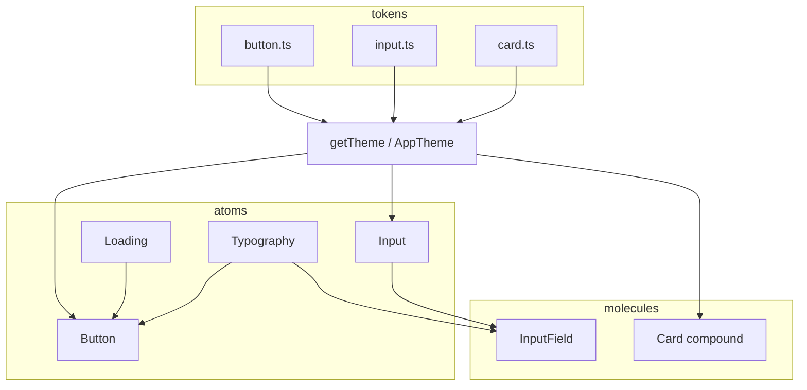

# DS Controls — Design

**Spec**: `.specs/features/ds-controls/spec.md`  
**Context**: `.specs/features/ds-controls/context.md`  
**Status**: Approved — Approach A (user 2026-07-31)

---

## Approach exploration

| Approach | Summary | Pros | Cons |
| --- | --- | --- | --- |
| **A — Token-per-control (recommended)** | `tokens/button.ts`, `tokens/input.ts`, `tokens/card.ts`; atoms Button/Input; molecules InputField/Card; theme wires new token slices | Matches AD-014/017 (“tokens own variation”); same shape as `icon`/`loading`/`typography`; easy to extend | +3 token files |
| B — Single `tokens/controls.ts` | One bag for all button/input/card maps | Fewer files | Cohesion breaks as DS grows; harder reviews |
| C — Shared “chrome” primitives | Extract FieldChrome / PressableBase, then compose | Max reuse | Over-abstract for 4 pieces; fights AD-012 folder-per-piece |

**Recommendation: A.** Conform to AD-004, AD-009, AD-012, AD-013, AD-017. No new project AD needed unless compound-Card export pattern should be locked globally (feature-local for now).

---

## Architecture Overview



**Flow**

1. Tokens define variant/size/state maps (object maps, AD-013).
2. Theme exposes `theme.button`, `theme.input`, `theme.card` (plus existing colors/radius/spacing).
3. Atoms select tokens via `$variant` / `$size` / `$state` in `styles.tsx` only.
4. InputField orchestrates label/helper/error + forwards slots/value to Input.
5. Card is a compound molecule: root chrome + static region members.

---

## Code Reuse Analysis

### Existing Components to Leverage

| Component | Location | How to Use |
| --- | --- | --- |
| Loading | `atoms/Loading` | Button `loading` — map button size → Loading `variant` (`sm`\|`md` → `sm`, `lg` → `lg`) |
| Typography | `atoms/Typography` | Button label (`label` variant); InputField label (`label`); helper/error (`caption` + tone) |
| tone / colors | `tokens/tone.ts`, `colors.ts` | Error → `danger`; primary fill → `theme.colors.primary` |
| radius / spacing | `tokens/radius.ts`, `spacing.ts` | Input/Card chrome; Button padding |
| Atom folder pattern | e.g. `atoms/Icon/` | AD-012 shape + Omit host `style` + `...rest` |
| Molecule pattern | `molecules/Container/`, `Header/` | Composition in `Name.tsx`; styled only in `styles.tsx` |
| Theme | `theme/theme.ts`, `styled.d.ts` | Extend `AppTheme` with button/input/card slices |

### Integration Points

| System | Integration Method |
| --- | --- |
| Storybook | Colocated `*.stories.tsx`; existing themeMode/dataSource globals |
| Public barrel | `atoms/index.ts`, `molecules/index.ts` → `ds/index.ts` already re-exports |
| README | Extend Atomic table rows |

---

## Components

### tokens — button

- **Purpose**: Own Button variant + size metrics (padding, minHeight, label typography variant, loading variant).
- **Location**: `src/components/ds/tokens/button.ts`
- **Interfaces**:
  - `ButtonVariant = 'primary' | 'outline' | 'ghost'`
  - `ButtonSize = 'sm' | 'md' | 'lg'`
  - `buttonSizes: Record<ButtonSize, { paddingVertical, paddingHorizontal, minHeight, loadingVariant }>`
  - Chrome colors resolved in styles from `variant` × `theme.colors` (object map), not hardcoded hex
- **Dependencies**: `LoadingVariant`, spacing/radius as needed
- **Reuses**: Same pattern as `tokens/loading.ts` / `icon.ts`

### tokens — input

- **Purpose**: Own Input field state chrome (border color token key per `default` \| `error`).
- **Location**: `src/components/ds/tokens/input.ts`
- **Interfaces**:
  - `InputState = 'default' | 'error'`
  - `inputStateMap: Record<InputState, ColorToken>` (e.g. default→`border`, error→`danger`)
  - Shared layout tokens: padding, radius key, minHeight (single density)
- **Dependencies**: `ColorToken`, `radius`, `spacing`
- **Reuses**: tone/color token pattern

### tokens — card

- **Purpose**: Own Card surface chrome (radius, border, padding defaults for regions).
- **Location**: `src/components/ds/tokens/card.ts`
- **Interfaces**:
  - `card: { radius, borderColorToken, surfaceTone }` or equivalent Record maps
- **Dependencies**: `radius`, `ColorToken`, `SurfaceTone`
- **Reuses**: Container’s surface idea, but **not** the Container component

### atom — Button

- **Purpose**: Typed pressable with variants, sizes, loading/disabled, leading/trailing slots.
- **Location**: `src/components/ds/atoms/Button/`
- **Interfaces**:
  - `ButtonProps = Omit<PressableProps, 'style' | 'children' | 'disabled'> & { variant?; size?; loading?; disabled?; leading?; trailing?; children?: ReactNode }`
  - Defaults: `variant='primary'`, `size='md'`, `loading=false`
  - `testID` default `ds-button`
- **Dependencies**: Loading atom; button tokens via theme; Typography for string/node label (`children`)
- **Reuses**: Loading; object maps in `styles.tsx`; a11y defaults in `Button.tsx` (`accessibilityRole="button"`, busy when loading)

**Loading behavior (locked):** when `loading`, render only `<Loading variant={map[size]} />`; block press; keep `minHeight`/`minWidth` from size token.

### atom — Input

- **Purpose**: Bordered text-field chrome with leading/trailing slots and `state`.
- **Location**: `src/components/ds/atoms/Input/`
- **Interfaces**:
  - `InputProps = Omit<TextInputProps, 'style'> & { leading?; trailing?; state?: InputState }`
  - Default `state='default'`
  - `testID` default `ds-input` on chrome; text host identifiable for tests
- **Dependencies**: input tokens; theme colors
- **Reuses**: RN `TextInput` via `styled(TextInput)` in `styles.tsx`; outer row View for slots

### molecule — InputField

- **Purpose**: §6.2 form field — label + Input + helper/error.
- **Location**: `src/components/ds/molecules/InputField/`
- **Interfaces**:
  - `InputFieldProps = { label?: string; helperText?: string; error?: string; leading?; trailing?; value?; onChangeText?; ...forwarded Input props minus state }`
  - Derives `state`: non-empty `error` → `'error'`, else `'default'`
  - Message line: non-empty `error` → error text (`tone="danger"`); else `helperText` (`tone="muted"`)
- **Dependencies**: Typography, Input
- **Reuses**: Header’s “compose atoms” style

### molecule — Card (compound)

- **Purpose**: Surface with optional Header / Content / Footer regions.
- **Location**: `src/components/ds/molecules/Card/`
- **Interfaces**:
  - `Card(props: { children?: ReactNode })` — root chrome
  - `Card.Header`, `Card.Content`, `Card.Footer` — region wrappers (`children?: ReactNode`)
  - Implementation: `const Card = Object.assign(CardRoot, { Header, Content, Footer })` (or equivalent) so `import { Card }` works with compound members
  - Regions do **not** import/use Container
- **Dependencies**: card tokens; theme
- **Reuses**: AD-012 folder; compound members may share `styles.tsx`

### docs + barrels

- **Purpose**: Export + README Atomic classification.
- **Location**: `atoms/index.ts`, `molecules/index.ts`, `tokens/index.ts`, `theme/*`, `README.md`
- **Interfaces**: public imports unchanged pattern (`@/components/ds`)

---

## Data Models

N/A — UI primitives only. Token Records are the “models”:

```typescript
// illustrative — exact fields finalized in implement
type ButtonSizeToken = {
  paddingVertical: number;
  paddingHorizontal: number;
  minHeight: number;
  loadingVariant: 'sm' | 'lg';
};

type InputState = 'default' | 'error';
```

---

## Error Handling Strategy

| Error Scenario | Handling | User Impact |
| --- | --- | --- |
| InputField `error` non-empty | Message = error; Input `state="error"` | Danger border + danger caption |
| InputField `error=""` | Treat as no error | helperText may show |
| Button `loading` + press | `onPress` not called | No double submit |
| Invalid variant/size at compile time | TS unions from tokens | Dev-time only |

---

## Risks & Concerns

| Concern | Location | Impact | Mitigation |
| --- | --- | --- | --- |
| Loading only has `sm` \| `lg` | `tokens/loading.ts` | Button `md` has no 1:1 spinner size | Map `sm`+`md` → Loading `sm`, `lg` → `lg` (spec OK) |
| Compound Card typing | new `Card/` | Easy to break `Card.Header` types | Explicit `CardComponent` type with static members; cover in unit test |
| Prior docs called Input/Card “atoms” | old specs/README | Classification drift | CTRL-05 README update |
| Button primary must track dataSource | theme primary | Hardcoded green/orange fails flip | styles use `theme.colors.primary` only |
| Uncommitted DS work on branch | working tree | Merge noise | Implement on current `feat/design-system`; keep commits atomic per task |

---

## Tech Decisions (non-obvious)

| Decision | Choice | Rationale |
| --- | --- | --- |
| Token modules | Separate `button` / `input` / `card` files | Approach A; AD-017 |
| Card compound export | `Object.assign(Root, { Header, Content, Footer })` | Single import; matches React compound idiom |
| InputField owns error orchestration | Atom only has `state` | Locked in context |
| Button label | `children` (not `title` prop) | Flexible with slots; Typography wraps string children in composition if needed |
| Input density | Single size | Spec out of scope for input sizes |
| New AD? | None this slice | Conventions already AD-012..017; compound Card stays feature-local |

---

## Confirm before Tasks

Approve **Approach A** (and this design draft) to proceed to `tasks.md`.
