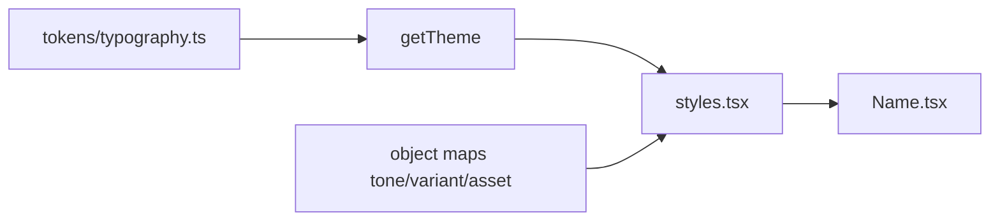

# Design System Conventions — Design

**Spec**: `.specs/features/ds-conventions/spec.md`  
**Status**: Approved (Approach locked by AD-012..014; user confirmed system `fontFamily`)

---

## Architecture Overview

Refactor-only. No new product features. Bring every shipped DS piece to:

```
ComponentName/
  index.ts
  ComponentName.tsx      # composition only
  ComponentName.stories.tsx
  styles.tsx             # only place with styled(...)
  __tests__/...
```



**Typography tokens** (`typography.ts`): `Record<TypographyVariant, { fontFamily, fontWeight, lineHeight }>` (+ optional defaultSize). Theme exposes `theme.typography`. `size` prop still maps `theme.sizes` for `font-size` (heading may keep xl rule via map).

**System fontFamily**: platform-safe RN defaults (e.g. `System` / leave consistent string used across variants in v1 — same family for all variants unless weight needs platform-specific names). No `expo-font` in this feature.

**Third-party leaves**: `styled(Ionicons)`, `styled(ActivityIndicator)`, `styled(View)` — attrs from theme/maps; public API still omits `style`.

---

## Code Reuse

| Existing | Use |
| --- | --- |
| All current DS components + tests | Migrate in place; strengthen Typography tests for fontFamily/weight/lineHeight tokens |
| `getTheme` / `AppTheme` | Add `typography` field |
| Brand SVG imports in DataSourceLogo only | Keep AD-011; replace switch with component map |
| Legacy `components/Text*` | Delete or thin re-export → Typography |

---

## Components

| Piece | Change |
| --- | --- |
| `tokens/typography.ts` | New; barrel + theme |
| Typography | Split styles; maps for tone + variant metrics |
| Icon, Spacer, Loading | styles.tsx + maps |
| Container, Header | styles.tsx |
| DataSourceLogo | asset map + styles for size if needed |
| README | Document file shape |

---

## Risks & Concerns

| Concern | Mitigation |
| --- | --- |
| RNTL style flattening after styled split | Keep asserting `props.style` objectContaining token values |
| Ionicons/ActivityIndicator + styled | Use `styled(Component).attrs` / transient `$` props |
| Heading fontSize vs size prop | Preserve current behavior via explicit map rule in styles |
| Grep gates for `switch` | Allow runtime guard throws only; no style switches |

---

## Confirm

Approved with user confirmation of system fonts (2026-07-31). Proceed to tasks.
