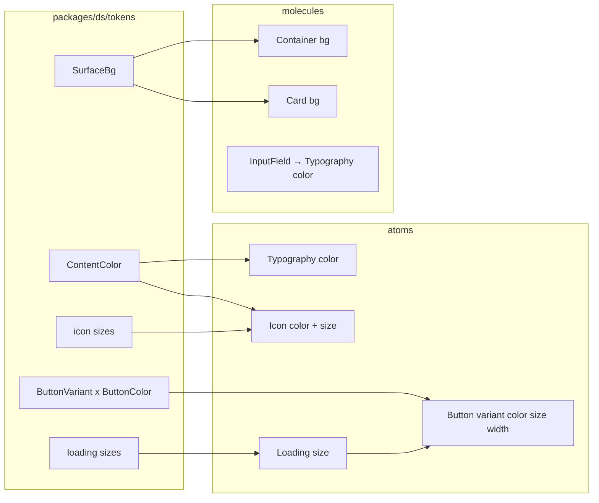

# DS MUI Props Design

**Spec**: `.specs/features/ds-mui-props/spec.md`  
**Context**: `.specs/features/ds-mui-props/context.md`  
**Status**: Done — Verifier PASS (2026-08-03)

---

## Approach exploration (Large)

| Approach | Summary | Pros | Cons |
| -------- | ------- | ---- | ---- |
| **A — In-place API rename + Button 2-axis chrome (recommended)** | Apagar `tone.ts`; tipos `ContentColor` / `SurfaceBg`; content `color` resolve direto em `theme.colors[color]`; Button `variant×color` via object maps; Icon/Loading `size`; `style` no public props; big-bang consumers | Diff contido; honra context; AD-012/013 intactos; sem shim | Breaking em tudo que usa `tone` |
| B — Compatibility layer (`tone` deprecated → maps to `color`/`bg`) | Facilita migração gradual | Spec/context exigem big-bang **sem** aliases | Viola PROP-08 / E |
| C — Introduzir `sx` + system props parciais | Mais “MUI completo” | Explicitamente out of scope | Escopo e complexidade |

**Recommendation: A.** Context e spec já fecham vocabulário e migração; este design detalha A.

---

## Architecture Overview

Não há nova camada de app — só contrato público da lib `@ds` + migração de call sites.



**Prop axes (público)**

| Eixo | Prop | Onde | Valores |
| ---- | ---- | ---- | ------- |
| Conteúdo | `color` | Typography, Icon | `text` \| `muted` \| `primary` \| `danger` |
| Superfície | `bg` | Container, Card | `background` \| `surface` |
| Chrome | `variant` | Button; Typography (type role) | Button: `contained` \| `outlined` \| `text` |
| Paleta ação | `color` | Button | `primary` \| `success` \| `warning` \| `danger` |
| Escala | `size` | Icon, Loading, Logo, Button, Spacer | tokens atuais por peça |
| Largura | `width` | Button | `hug` \| `full` (default `full`) |
| Escape | `style` | Todos os exports públicos DS | RN `StyleProp` → host styled |

**AD impacto**

| AD | Ação |
| -- | ---- |
| AD-016 (`tone` / `toneColorMap`) | **Superseded** por AD-028 |
| AD-017 (Icon/Loading `variant`=size; omit `style`) | **Superseded** por AD-028 nas partes de tone/variant-size/`Omit style`; resto (object maps, styles.tsx, a11y defaults, Spacer fechado) **permanece** |
| AD-012, AD-013, AD-014 | **Conform** (shape, maps, tipografia sem `size`) |
| AD-004 / path lib | **Conform** — continua `packages/ds` |

---

## Code Reuse Analysis

### Existing Components to Leverage

| Component | Location | How to Use |
| --- | --- | --- |
| `theme.colors.*` | `tokens/colors.ts` | Fonte única; `ContentColor` / `SurfaceBg` / `ButtonColor` ⊆ `ColorToken` |
| Button chrome map | `atoms/Button/styles.tsx` | Generalizar de 1-eixo (`primary\|outline\|ghost`) para `variant` × `colors[color]` |
| `button` size tokens | `tokens/button.ts` | Manter métricas; renomear `loadingVariant` → `loadingSize` |
| `icon` / `loading` records | `tokens/icon.ts`, `loading.ts` | Mesmos valores; tipos `IconSize` / `LoadingSize` |
| `card.surfaceTone` | `tokens/card.ts` | Renomear para `defaultBg: 'surface'`; Card usa como default de `bg` |
| Container layout | `molecules/Container` | Trocar `tone`→`bg`; default fill removido |
| Object-map pattern | AD-013 em todo DS | Chrome Button, width map, etc. |
| App/Story consumers | `src/presentation/**`, stories | Big-bang `tone`→`color`/`bg`; Icon `variant`→`size` |

### Integration Points

| System | Integration Method |
| --- | --- |
| Theme / brand primary | Sem mudança em `getTheme`; `color="primary"` continua a seguir brand |
| Storybook | Atualizar args/controls; sem globals novos |
| Jest / RNTL | Atualizar asserts (`tone`→`color`/`bg`); gate `pnpm test` |
| README DS section | Reescrever tabela de props (hoje ainda cita `tone`) |

---

## Components

### Tokens: content + surface (replace `tone.ts`)

- **Purpose**: Tipos de domínio de cor de conteúdo e de superfície; eliminar `Tone` / `SurfaceTone` / `toneColorMap`.
- **Location**: `packages/ds/tokens/content-color.ts`, `packages/ds/tokens/surface.ts` (apagar `tone.ts`)
- **Interfaces**:
  - `export type ContentColor = 'text' | 'muted' | 'primary' | 'danger'`
  - `export type SurfaceBg = 'background' | 'surface'`
  - Sem mapa de indireção: `ContentColor` e `SurfaceBg` são subsets de `ColorToken` — styled usa `theme.colors[color]` / `theme.colors[bg]` direto
  - Opcional: `contentColors` / `surfaceBgs` `as const` + `satisfies` para exhaustiveness nos testes
- **Dependencies**: `ColorToken` (só para documentação/`satisfies` se útil)
- **Reuses**: Valores já em `colors.light|dark`

### Tokens: button

- **Purpose**: Variants MUI-like + cores de ação + size + loading size key.
- **Location**: `packages/ds/tokens/button.ts`
- **Interfaces**:
  - `ButtonVariant = 'contained' | 'outlined' | 'text'`
  - `ButtonColor = 'primary' | 'success' | 'warning' | 'danger'`
  - `ButtonWidth = 'hug' | 'full'`
  - `button[size].loadingSize` (ex-`loadingVariant`) → `LoadingSize`
  - `buttonVariants` / `buttonColors` records para maps
- **Dependencies**: `loading` sizes
- **Reuses**: métricas `sm|md|lg` atuais

### Tokens: icon / loading / card

- **Purpose**: Rename de tipos de escala; card default surface.
- **Location**: `icon.ts`, `loading.ts`, `card.ts`
- **Interfaces**:
  - `IconSize = keyof typeof icon` (export; deprecar nome `IconVariant`)
  - `LoadingSize = keyof typeof loading` (export; deprecar `LoadingVariant`)
  - `card.defaultBg: SurfaceBg` (`'surface'`) — remove `surfaceTone`
- **Reuses**: pixel maps existentes

### Typography

- **Purpose**: Texto tipado por `variant` + `color`.
- **Location**: `packages/ds/atoms/Typography/`
- **Interfaces**:
  - `TypographyProps`: `Omit<RNTextProps, never>` ou host props **incluindo** `style`; `variant?`; `color?: ContentColor` (default `'text'`)
  - Styled: `$variant`, `$color` → `theme.colors[$color]`
- **Dependencies**: tokens tipografia + ContentColor
- **Reuses**: metrics AD-014

### Icon

- **Purpose**: Glyph com `size` + `color`.
- **Location**: `packages/ds/atoms/Icon/`
- **Interfaces**:
  - `Omit<IoniconsProps, 'size' | 'color'>` — **não** omitir `style`; DS `size?: IconSize`, `color?: ContentColor`
  - Host size/color via `.attrs` / styled transient `$size` `$color` (impede colisão com props Ionicons)
- **Dependencies**: `icon` tokens, ContentColor
- **Reuses**: Ionicons attrs pattern atual

### Loading

- **Purpose**: Indicator com `size` (não `variant`).
- **Location**: `packages/ds/atoms/Loading/`
- **Interfaces**:
  - `size?: LoadingSize`; aceitar `style`; continuar omitindo host `size`/`color` nativos em favor dos tokens DS
- **Reuses**: ActivityIndicator `.attrs`

### Button

- **Purpose**: Ação com chrome × paleta × size × width.
- **Location**: `packages/ds/atoms/Button/`
- **Interfaces**:
  - Props: `variant?: ButtonVariant`, `color?: ButtonColor`, `size?: ButtonSize`, `width?: ButtonWidth`, `loading?`, `disabled?`, `leading?`, `trailing?`, `children?`, **`style?`**, resto Pressable (sem omitir `style`)
  - Defaults: `contained`, `primary`, `md`, `full`
  - Chrome map (object, AD-013):

```typescript
// conceptual
type Chrome = { backgroundColor; borderColor; borderWidth; labelColor }
const chromeByVariant = {
  contained: (c: string, canvas: string): Chrome => ({
    backgroundColor: c, borderColor: c, borderWidth: 1, labelColor: canvas,
  }),
  outlined: (c: string): Chrome => ({
    backgroundColor: 'transparent', borderColor: c, borderWidth: 1, labelColor: c,
  }),
  text: (c: string): Chrome => ({
    backgroundColor: 'transparent', borderColor: 'transparent', borderWidth: 0, labelColor: c,
  }),
} as const
// c = theme.colors[buttonColor]; canvas = theme.colors.background (label on filled — same as today)
```

  - Width map: `full` → `alignSelf: 'stretch'` + `width: '100%'`; `hug` → `alignSelf: 'flex-start'` + `width` auto/undefined
  - Loading: `<Loading size={theme.button[size].loadingSize} />`
  - `ButtonLabel` recebe `$color` + `$variant` (não só variant)
- **Dependencies**: Pressable host atual (não extrair atom)
- **Reuses**: size tokens, radius.md, label typography

### Container

- **Purpose**: Layout box com `bg` opcional.
- **Location**: `packages/ds/molecules/Container/`
- **Interfaces**:
  - `bg?: SurfaceBg` — **sem default**
  - Styled: aplicar `background-color` **somente** se `$bg` definido; caso contrário não setar (transparente/herda)
  - Aceitar `style` no root
- **Reuses**: spacing/flex/safe existentes

### Card

- **Purpose**: Superfície card com `bg` alinhado ao Container.
- **Location**: `packages/ds/molecules/Card/`
- **Interfaces**:
  - `CardProps`: `bg?: SurfaceBg`, `style?`, `children?`, `testID?`
  - Resolve fill: `bg ?? theme.card.defaultBg` (`surface`)
  - Header/Content/Footer: aceitar `style` nos regions se forem hosts View (mínimo: root Card)
- **Reuses**: radius/border tokens

### Input / InputField / Header / Spacer / KeyboardAvoid / DataSourceLogo

- **Purpose**: Conformar `style` passthrough (+ InputField `color` nas mensagens).
- **Location**: respectivos folders
- **Interfaces**:
  - Remover `Omit<…, 'style'>` das props públicas; repassar `style` ao styled host
  - InputField: `color={hasError ? 'danger' : 'muted'}` no caption
  - Spacer: adicionar `style?` opcional além do contrato de edge (exceção AD-017 “props fechadas” **parcialmente** aberta só para `style` — documentar em AD-028)
  - Logo: já tem `size`; só garantir `style` se houver host View
- **Reuses**: composição atual

### Docs

- **Purpose**: PROP-22 / PROP-23.
- **Location**: `README.md` (seção Design System), `.specs/STATE.md` (AD-028 + supersede 016/017)
- **Content outline**:
  - Motivação: padrão claro + ferramentas para montar telas
  - Tabela dos eixos de props
  - Big-bang / sem aliases `tone`
  - `style` ok; `sx` não

---

## Data Models

```typescript
type ContentColor = 'text' | 'muted' | 'primary' | 'danger'
type SurfaceBg = 'background' | 'surface'
type ButtonVariant = 'contained' | 'outlined' | 'text'
type ButtonColor = 'primary' | 'success' | 'warning' | 'danger'
type ButtonWidth = 'hug' | 'full'
type IconSize = 'xs' | 'sm' | 'md' | 'lg' | 'xl'  // from icon tokens
type LoadingSize = 'sm' | 'lg'
```

**Relationships**: `ContentColor`, `SurfaceBg`, `ButtonColor` ⊆ `ColorToken` (sem hex novos).

---

## Error Handling Strategy

| Error Scenario | Handling | User Impact |
| --- | --- | --- |
| Prop fora do union | TypeScript compile error | Dev corrige no editor |
| Spacer sem edge / multi-edge | Runtime throw existente | Inalterado |
| `style` vs token chrome | Merge RN padrão | Escape intencional do consumidor |

---

## Risks & Concerns

| Concern | Location | Impact | Mitigation |
| ------- | -------- | ------ | ---------- |
| README cita `tone` e AD-028 prematuro p/ path da lib | `README.md` ~L139–146 | Docs mentem vs código pós-feature | Task docs reescreve seção DS; AD-028 = props MUI-like (não path) |
| Button `contained` label usa `colors.background` | `Button/styles.tsx` | Em themes onde background ≠ “on-primary”, contraste pode falhar em success/warning | Manter regra atual (canvas = `background`); hex já pensados p/ primary; aceitar mesmo padrão p/ outras cores nesta fatia |
| Container sem `bg` em telas que dependiam do default `background` | `SearchReposScreen` etc. | Telas “transparentes” sobre nav | Big-bang: ou passar `bg="background"` onde a tela precisa de fill, ou confiar no parent — **preferir** `bg="background"` explícito nas screens de produto que hoje usam `tone="background"` |
| `Omit style` em vários atoms | Typography, Button, Input, Icon, Loading, InputField | PROP-20 falha se esquecer um | Task checklist + grep gate |
| Testes/stories espalhados | `packages/ds/**/__tests__`, `src/presentation/**` | Gate vermelho no meio da migração | Uma fatia ordered: tokens → atoms → molecules → consumers → docs; um commit por task |

---

## Tech Decisions (non-obvious)

| Decision | Choice | Rationale |
| -------- | ------ | --------- |
| Módulo pós-`tone` | `content-color.ts` + `surface.ts` | Domínios separados = props `color` vs `bg` |
| Indireção `toneColorMap` | Removida | Valores já são `ColorToken` |
| Label em `contained` | `theme.colors.background` | Preserva look primary atual; aplica às outras `ButtonColor` |
| Width `full` | `width: '100%'` + `alignSelf: 'stretch'` | Funciona em column parents típicos |
| Width `hug` | `alignSelf: 'flex-start'` | Evita stretch do Pressable |
| Card default | `bg ?? card.defaultBg` (`surface`) | Spec: Card sem `bg` mantém surface |
| Container omit `bg` | Não emitir `background-color` no CSS | Spec PROP-05 |
| Próximo AD | **AD-028** — props MUI-like (`color`/`bg`/`variant`×palette/`size`/`width`/`style`); supersede AD-016 e trechos AD-017 | Project-level; gravar no STATE na task de docs |
| Spacer + `style` | Permitir só `style` extra | Escape hatch global; edges continuam exclusivos |

---

## Requirement → design map

| ID | Design coverage |
| -- | --------------- |
| PROP-01..03 | ContentColor + Typography/Icon + delete tone exports |
| PROP-04..06 | SurfaceBg + Container/Card |
| PROP-07..08 | InputField + consumer big-bang |
| PROP-09..16 | Button tokens + styles + Loading size |
| PROP-17..19 | Icon/Loading/Logo size |
| PROP-20..21 | style passthrough; no sx |
| PROP-22..23 | README + STATE AD-028 |

**Status:** Done — Verifier PASS (2026-08-03).
