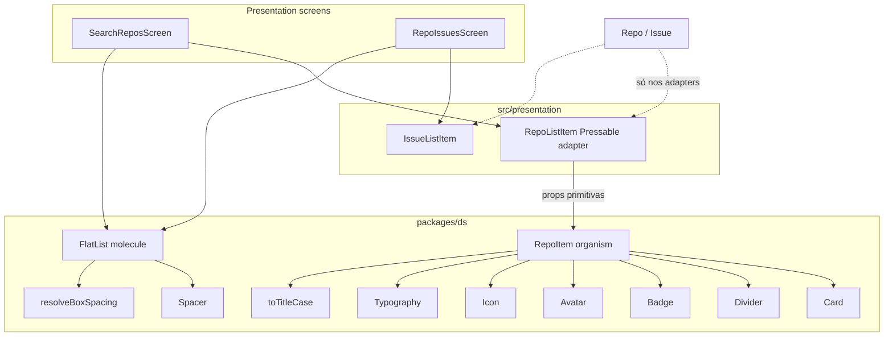

# DS RepoItem Design

**Spec**: `.specs/features/ds-repo-item/spec.md`  
**Context**: `.specs/features/ds-repo-item/context.md`  
**Status**: Approved

---

## Architecture Overview

Feature Medium→Large-ish UI: DS atoms/molecules/organism + presentation adapters. Sem novos padrões de app — reusa Card, Container spacing helpers, Spacer; isolamento AD-029.



**Dependency rule (unchanged)**

| Layer | May import |
| ----- | ---------- |
| `packages/ds` | React, RN, styled-components, vector-icons, `@ds/*` only |
| `RepoListItem` | `@/domain` (`Repo`), `@ds` components, RN `Pressable` |
| Screens | `@ds/molecules` FlatList + list item adapters; **não** `FlatList` de `react-native` para essas listas |

---

## Code Reuse Analysis

### Existing Components to Leverage

| Component | Location | How to Use |
| --------- | -------- | ---------- |
| Card compound | `packages/ds/molecules/Card` | RepoItem shell |
| Badge / Avatar / Icon / Typography / Spacer | `packages/ds/atoms/*` | RepoItem + FlatList separator |
| `resolveBoxSpacing` | `packages/ds/molecules/Container/resolveBoxSpacing.ts` | FlatList content padding tokens → px |
| AD-012 folder | peers | Divider, RepoItem, FlatList |
| `formatRelativeDate` util pattern | `packages/ds/utils/` | Mirror for `toTitleCase` |
| RepoListItem / screens | presentation search | Adapter + migrate lists |

### Integration Points

| System | Integration Method |
| ------ | ------------------ |
| SearchReposScreen | DS FlatList + RepoListItem → RepoItem |
| RepoIssuesScreen | DS FlatList + IssueListItem (unchanged item) |
| Storybook | `DS/Atoms/Divider`, `DS/Organisms/RepoItem`, `DS/Molecules/FlatList` |

---

## Components

### `toTitleCase` (util)

- **Purpose**: Title Case para display; prop `name` crua.
- **Location**: `packages/ds/utils/to-title-case.ts`
- **Interfaces**: `toTitleCase(value: string): string`
- **Reuses**: util test/export pattern

### Divider (atom)

- **Purpose**: Separador 1px H/V com `theme.colors.border`.
- **Location**: `packages/ds/atoms/Divider/`
- **Interfaces**: `orientation?: 'horizontal' | 'vertical'`; default horizontal; `testID="ds-divider"`
- **Chrome**: object map (AD-013); sem `tokens/divider.ts`

### RepoItem (organism)

- **Purpose**: Card presentational do mock.
- **Location**: `packages/ds/organisms/RepoItem/`
- **Interfaces**:

```typescript
type RepoLanguage = { label: string; swatch?: string };

type RepoItemProps = {
  name: string;
  description?: string;
  languages?: RepoLanguage[];
  ownerName: string;
  ownerAvatarUrl?: string;
  stars: number;
  forks?: number;
  style?: StyleProp<ViewStyle>;
  testID?: string; // default 'ds-repo-item'
};
```

- **Layout**: title Capitalize → optional description → badges | Avatar → horizontal Divider → star (+ fork if defined)
- **Reuses**: Card, atoms, `toTitleCase`; store-free

### FlatList (molecule)

- **Purpose**: Lista tipada com padding no **content**, Spacer default, perf defaults, pass-through RN.
- **Location**: `packages/ds/molecules/FlatList/`
- **Interfaces** (sketch):

```typescript
type FlatListSpacingProps = Pick<
  ContainerProps,
  'p' | 'px' | 'py' | 'pt' | 'pb' | 'pl' | 'pr'
>;

type DsFlatListProps<ItemT> = FlatListSpacingProps &
  Omit<RNFlatListProps<ItemT>, 'ItemSeparatorComponent'> & {
    separator?: boolean; // default true → Spacer top lg
    separatorSize?: Spacing; // default 'lg'
    ItemSeparatorComponent?: RNFlatListProps<ItemT>['ItemSeparatorComponent'];
    // contentContainerStyle + style + perf props all overridable
  };
```

- **Behavior**:
  1. Resolve spacing via `resolveBoxSpacing` → object padding for **contentContainerStyle only**
  2. Default `px = 'md'` when no horizontal padding prop set (design: if any of `p`/`px`/`pl`/`pr` passed, honor those; else default `px: 'md'`)
  3. Merge: `contentContainerStyle={[paddingStyle, consumerContentContainerStyle]}`
  4. Root `style`: default `{ flex: 1 }` merge with consumer `style` — **no padding keys**
  5. Separator: if `ItemSeparatorComponent` provided → use it; else if `separator === false` → undefined; else `() => <Spacer top size={separatorSize ?? 'lg'} />`
  6. Perf defaults (consumer wins): `initialNumToRender={20}`, `onEndReachedThreshold={0.5}`, `windowSize={10}`, `maxToRenderPerBatch={10}`, `updateCellsBatchingPeriod={50}`
- **Dependencies**: RN FlatList, Spacer, theme/`resolveBoxSpacing`
- **Reuses**: Container spacing resolution (import helper, not wrap list in Container)
- **testID**: default `ds-flat-list` (screens keep own `testID`s)

### RepoListItem (adapter — modify)

- Map `Repo` → `RepoItem`; Pressable unchanged.

### SearchReposScreen / RepoIssuesScreen (modify)

- Trocar `FlatList` RN → `@ds/molecules` `FlatList`
- Remover `ItemSeparatorComponent` / perf props redundantes (herdam defaults)
- Remover `px` duplicado do Container que envolve a lista (padding fica no content da lista)
- Preservar `testID`s (`search-repos-list`, `repo-issues-list`), refreshControl, onEndReached wiring

---

## Data Models

Nenhum modelo de domínio novo. UI-only: `RepoLanguage`; FlatList genérico `ItemT`.

---

## Error Handling Strategy

| Error Scenario | Handling | User Impact |
| -------------- | -------- | ----------- |
| Avatar URI fail | Avatar initials | Iniciais |
| description whitespace | omit | Sem descrição |
| forks undefined | omit fork stat | Só stars |
| FlatList empty data | RN empty list | Telas já tratam empty **antes** de montar a lista |

---

## Risks & Concerns

| Concern | Location | Impact | Mitigation |
| ------- | -------- | ------ | ---------- |
| Double padding após migração | SearchReposScreen / RepoIssuesScreen | Conteúdo estreito demais | AC: tirar `px` do Container pai da lista na mesma task |
| Testes de source assertam `FlatList` de RN | `SearchReposScreen.test.tsx` | Quebra | Atualizar assert para import/`@ds` FlatList |
| `resolveBoxSpacing` acoplado a pasta Container | `Container/resolveBoxSpacing.ts` | Import cross-molecule | OK — helper puro; opcional re-export depois (fora de escopo) |
| Nome `FlatList` sombra RN | molecules barrel | Confusão de import | Screens importam só de `@ds/molecules`; documentar no Storybook/README se tocarmos docs |

---

## Tech Decisions

| Decision | Choice | Rationale |
| -------- | ------ | --------- |
| Title Case helper | `packages/ds/utils/toTitleCase` | Testável; espelha utils existentes |
| Fork icon | `git-network` | Legível em sm |
| Divider tokens file | Não | 1px + border color |
| FlatList padding host | Só `contentContainerStyle` | Pedido explícito / scroll best practice |
| Default separator | Spacer `top` `lg` | Match telas atuais |
| Perf defaults | Ver ACs | Match + RN sensato |
| Default content `px` | `md` | Match Containers atuais |
| Press | Fora do RepoItem | Context 5A |

> Sem AD-NNN novo. Conforma AD-012, AD-013, AD-028, AD-029.
