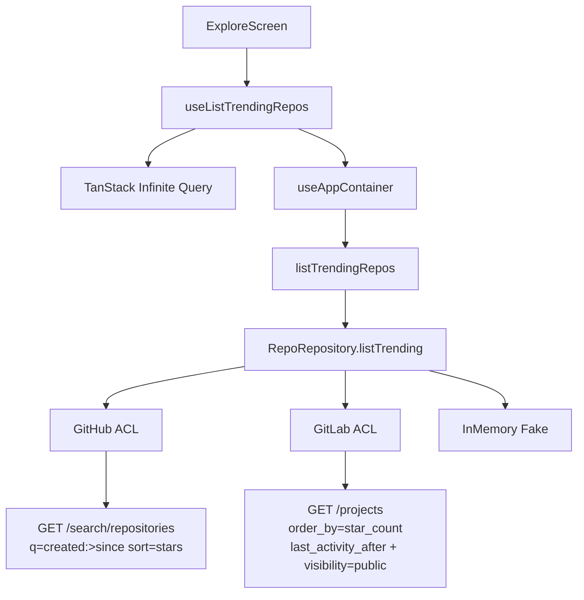

# Explore Trending Design

**Spec**: `.specs/features/explore-trending/spec.md`  
**Context**: `.specs/features/explore-trending/context.md`  
**Status**: Approved (user 2026-08-03)

---

## Architecture Overview

Extensão vertical do contrato existente: nova operação na porta `RepoRepository`, use case fino, adapters ACL (GitHub Search / GitLab Projects), DI, hook TanStack Infinite Query, e `ExploreScreen` simples. Sem `if (provider)` na presentation (AD-002). Janela de 30 dias e query params ficam **somente** na infrastructure.



Conformidade com decisões ativas: AD-001…007, AD-019 (domínio sem nomes de provedor), AD-020/021/022 (DI + HTTP ACL), AD-023/025 (presentation hooks + `queryKey` com `dataSource`, sem invalidate no toggle), AD-005 (Query na borda).

---

## Code Reuse Analysis

### Existing Components to Leverage

| Component | Location | How to Use |
| --------- | -------- | ---------- |
| `RepoRepository` / `PaginatedResult` / `Repo` | `src/domain/**` | Estender porta; reutilizar entity |
| `assertPage` / `assertPerPage` | `src/domain/validation` | Use case trending |
| `DEFAULT_PAGE` / `DEFAULT_PER_PAGE` | `src/application/constants/pagination.ts` | Defaults do use case |
| `createSearchRepos` pattern | `src/application/use-cases/search-repos.ts` | Espelhar factory |
| `createContainer` / `resolveRepository` | `src/infrastructure/di/**` | Wire `listTrendingRepos` |
| `jsonFetch` / `resolveHasNextPage` / mappers | `src/infrastructure/http|github|gitlab/**` | ACL trending |
| `createInMemoryRepoRepository` | `src/infrastructure/repositories/**` | Fake `listTrending` |
| `useSearchRepos` / `queryKeys` | `src/presentation/hooks|constants` | Espelhar infinite query |
| `mapAppErrorToMessage` | `src/presentation/errors/**` | Erro na Explore |
| DS atoms | `Typography`, `Spacer`, `Loading`, `Container`, `Header` | Layout simples |
| `renderHook` / Fake override | `src/test/render.tsx`, `setAppContainerTestRepository` | Testes |

### Integration Points

| System | Integration Method |
| ------ | ------------------ |
| GitHub Search API | `listTrending` → same base URL/auth as `search` |
| GitLab Projects API | `listTrending` → `/projects` **sem** `search`, com filtros trending |
| Session `dataSource` | Via `useAppContainer` / `queryKey` only |
| Tabs `Explore` | Substituir corpo de `ExploreScreen`; rota inalterada |

---

## Components

### Domain port extension

- **Purpose**: Contrato provider-agnostic para trending paginado.
- **Location**: `src/domain/repositories/repo-repository.ts` (+ barrel `src/domain/index.ts`)
- **Interfaces**:
  - `ListTrendingInput = { page: number; perPage?: number }`
  - `RepoRepository.listTrending(input: ListTrendingInput): Promise<PaginatedResult<Repo>>`
- **Dependencies**: Entities existing
- **Reuses**: Mesmo shape de paginação de `search`

### `createListTrendingRepos`

- **Purpose**: Validar page/perPage e delegar à porta.
- **Location**: `src/application/use-cases/list-trending-repos.ts`
- **Interfaces**:
  - `ListTrendingReposInput = { page?: number; perPage?: number }`
  - `createListTrendingRepos(repo): (input) => Promise<PaginatedResult<Repo>>`
- **Dependencies**: Domain asserts + pagination constants
- **Reuses**: Padrão de `createSearchRepos` (sem `normalizeSearchQuery`)

### Trending window helper (infra)

- **Purpose**: Única fonte do “since” de 30 dias para adapters.
- **Location**: `src/infrastructure/trending/window.ts`
- **Interfaces**:
  - `TRENDING_WINDOW_DAYS = 30`
  - `getTrendingSinceDate(now?: Date): string` → `YYYY-MM-DD` (GitHub qualifier)
  - `getTrendingSinceIso(now?: Date): string` → `YYYY-MM-DDTHH:MM:SSZ` (GitLab `last_activity_after`)
- **Dependencies**: None (pure)
- **Reuses**: N/A

### GitHub ACL `listTrending`

- **Purpose**: Proxy público de trending via Search API.
- **Location**: `src/infrastructure/github/create-github-repo-repository.ts`
- **Interfaces**: Implementa `listTrending`
- **HTTP**: `GET https://api.github.com/search/repositories?q=created:>{YYYY-MM-DD}&sort=stars&order=desc&page=&per_page=`
- **Dependencies**: `jsonFetch`, `mapGithubRepo`, `resolveHasNextPage`, search window cap existente
- **Reuses**: Mesmo path/mappers de `search` (query fixa de trending)

### GitLab ACL `listTrending`

- **Purpose**: Projetos públicos recentes ordenados por stars.
- **Location**: `src/infrastructure/gitlab/create-gitlab-repo-repository.ts`
- **Interfaces**: Implementa `listTrending`
- **HTTP**: `GET https://gitlab.com/api/v4/projects?order_by=star_count&sort=desc&visibility=public&last_activity_after={ISO}&page=&per_page=`
- **Dependencies**: `jsonFetch`, `mapGitlabRepo`, header next-page helper
- **Reuses**: Mapper/pagination de `search` (sem param `search`)

### Fake in-memory

- **Purpose**: Testes sem HTTP.
- **Location**: `src/infrastructure/repositories/in-memory-repo-repository.ts`
- **Behavior**: Ordena `repos` por `stars` desc e pagina (janela temporal ignorada — Fake não filtra por data; documentado nos testes).
- **Reuses**: Slice pagination de `search`

### DI

- **Purpose**: Expor `listTrendingRepos` no `AppContainer`.
- **Location**: `src/infrastructure/di/create-container.ts`
- **Interfaces**: `AppContainer.listTrendingRepos: ListTrendingRepos`
- **Reuses**: `createListTrendingRepos(repository)`

### Presentation hook

- **Purpose**: Infinite query de trending keyed by `dataSource`.
- **Location**: `src/presentation/hooks/use-list-trending-repos.ts` + `query-keys.ts`
- **Interfaces**:
  - `queryKeys.repos.trending(dataSource)` → `['repos', dataSource, 'trending']`
  - `useListTrendingRepos({ enabled?: boolean })` → `useInfiniteQuery` espelhando `useSearchRepos`
- **Dependencies**: `useAppContainer`, `DEFAULT_PAGE`
- **Reuses**: Padrão exact de search infinite query

### `ExploreScreen`

- **Purpose**: UI browse-only da tab Explore.
- **Location**: `src/screens/ExploreScreen.tsx` (+ `__tests__/ExploreScreen.test.tsx`)
- **UI**:
  - `Container` + `Header` title “Explore” (sem toggle de fonte aqui — Home já tem; Explore só lista)
  - `FlatList` de rows simples: `Typography` com `fullName`, linha muted com stars + language opcional, `Spacer`
  - States: first-load `Loading`; empty copy; error via `mapAppErrorToMessage`; footer `Loading` em `isFetchingNextPage`; `RefreshControl` → `refetch`
  - **Sem** `onPress` de navegação / Linking
- **Dependencies**: Hook + DS atoms + error mapper
- **Reuses**: Theme/Container patterns de `HomeScreen`

---

## Data Models

Nenhuma entity nova. Inputs:

```typescript
// domain
type ListTrendingInput = {
  page: number; // 1-based
  perPage?: number;
};

// application
type ListTrendingReposInput = {
  page?: number;
  perPage?: number;
};
```

`Repo` / `PaginatedResult<Repo>` inalterados.

---

## Error Handling Strategy

| Error Scenario | Handling | User Impact |
| -------------- | -------- | ----------- |
| First page `AppError` | Query `error` → `mapAppErrorToMessage` | Mensagem PT-BR; sem crash |
| `rate_limit` | Mesmo mapper (sem parse de `cause`) | Copy genérica de rate limit |
| Next-page failure | Manter items; flag/erro discreto (footer ou texto) | Lista preservada |
| Empty success | Empty state copy | Sem spinner eterno |
| HTTP mapping | Existing `mapHttpFailure` | Códigos de domínio |

---

## Risks & Concerns

| Concern | Location | Impact | Mitigation |
| ------- | -------- | ------ | ---------- |
| GitHub Search rate limit baixo (10/min anônimo) | Search API | Explore + Search competem pelo budget | Token opcional via DI já existente; mensagem `rate_limit` |
| Proxy “trending” ≠ algoritmo oficial GitHub Trending | ACL | Ranking aproximado | Documentado no design/spec; `created:>` + stars |
| GitLab `last_activity_after` ≠ “criados nos últimos 30d” | ACL | Semântica ligeiramente diferente entre fontes | Aceito — melhor API pública; encapsulado na ACL |
| Fake ignora janela de data | `in-memory-repo-repository.ts` | Testes não cobrem filtro temporal | MSW adapter tests cobrem query params; Fake só ordenação/paginação |
| Explore template ainda usa Themed* | `ExploreScreen.tsx` | Inconsistência visual | T8 remove template; só DS |
| Detalhes ainda inexistentes | Nav | User pode esperar tap | Spec: sem onPress de nav |

---

## Tech Decisions (non-obvious)

| Decision | Choice | Rationale |
| -------- | ------ | --------- |
| Nome da porta | `listTrending` | Spec / linguagem do produto |
| GitHub qualifier | `created:>YYYY-MM-DD` (30d) | Docs Search; proxy “novos em alta”; encapsulado na ACL |
| GitLab filter | `last_activity_after` + `visibility=public` + `order_by=star_count` | Docs Projects; público anônimo |
| Window helper | `src/infrastructure/trending/window.ts` | DRY entre adapters; fora do domínio (AD-019) |
| Fake ranking | Sort by `stars` desc, ignore date | Determinístico para testes de paginação |
| Explore chrome | Header “Explore” only; sem data-source toggle | Toggle já na Home; evita duplicar AD-018 UI |
| Nav on row | None | Context: esperar tela de detalhes |
| Project decision | **AD-026** (append STATE) | Porta `listTrending`; janela/params só na ACL |

---

## AD-026 (to append on Execute start / with design approval)

- **Decision**: `RepoRepository.listTrending` é a única porta para discovery trending; parâmetros de janela/API vivem na ACL (`infrastructure/trending` + adapters). Presentation só chama o use case via container.
- **Reason**: Mesma regra AD-002 para search; evita query mágica `stars:>1` na UI.
- **Scope**: Explore + futuros “featured” surfaces
- **Status**: active (após append em STATE)
