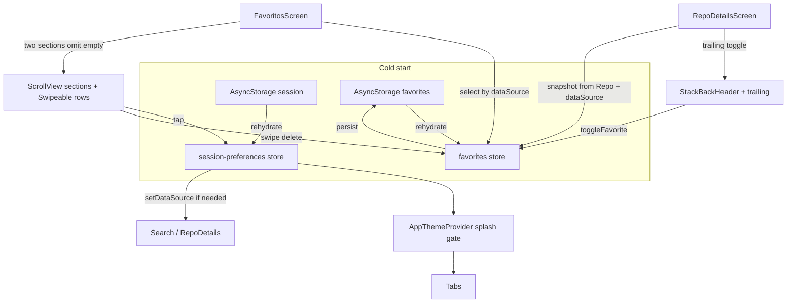

# Favorites Design

**Spec**: `.specs/features/favorites/spec.md`  
**Context**: `.specs/features/favorites/context.md`  
**Status**: Approved

---

## Architecture Overview

**Approach locked by context:** client-state Zustand under `src/presentation/stores/` (no domain port / AsyncStorage adapter). Favorites are a second persisted store alongside session preferences. Presentation owns UI + store wiring; DS organisms stay store-free (AD-029).



**Rejected:** domain `FavoritesRepository` + use cases (context). **Rejected:** unified flat list (spec revision).

---

## Code Reuse Analysis

### Existing Components to Leverage

| Component | Location | How to Use |
| --- | --- | --- |
| Session Zustand + persist pattern | `src/stores/session-preferences-store.ts` | Move to `presentation/stores`; clone pattern for favorites (factory + memory storage in tests) |
| `sanitizePersistedPreferences` / merge | same | Mirror `sanitizePersistedFavorites` for corrupt payload → `[]` |
| `memory-storage` | `src/test/memory-storage.ts` | Inject into favorites store tests |
| `Header` trailing | `packages/ds/molecules/Header` | Already supports `trailing` |
| `BackHeader` | `packages/ds/organisms/BackHeader` | Add optional `trailing?: ReactNode` |
| `StackBackHeader` | `src/presentation/components` | Passthrough `trailing` |
| `RepoItem` + `RepoListItem` | DS + presentation | Rows in Favoritos; mapper from snapshot |
| `mapRepoToRepoItemProps` | `src/presentation/mappers` | Sibling `mapFavoriteToRepoItemProps` |
| `DataSourceLogo` | `@ds/organisms` | Section headers (brand per list) |
| Explore nested nav + SessionSourceHeader | `ExploreScreen` / `SessionSourceHeader` | Same header chrome + `navigate('Search', { screen: 'RepoDetails', params })` |
| DS `FlatList` | optional | Prefer `ScrollView` + mapped rows (small N; avoid nested VirtualizedList) |
| `react-native-gesture-handler` | dependency + App import | `Swipeable` for delete |
| Icon Ionicons | `@ds/atoms/Icon` | `star` / `star-outline` for toggle |

### Integration Points

| System | Integration Method |
| --- | --- |
| Alias `@/` | Imports `@/presentation/stores/...`; delete `src/stores/` |
| App splash gate | Unchanged — only session prefs + tokens; Favoritos waits on **favorites** `hasHydrated` locally |
| Config `reset()` | Session reset does **not** clear favorites (separate concern; no product ask to wipe favorites on theme reset) |
| Jest zustand mock | Existing `__mocks__/zustand.ts` continues to apply |
| Tabs | `FavoritosScreen` replaces placeholder; types unchanged |

---

## Components

### Store relocation

- **Purpose**: Canonical home for client/session Zustand stores.
- **Location**: `src/presentation/stores/` (`session-preferences-store.ts`, `use-hydration.ts`, `favorites-store.ts`, `index.ts`)
- **Interfaces**: Re-export public API from barrel `@/presentation/stores`
- **Dependencies**: Update all `@/stores` consumers (presentation, theme, tests, `src/test/render.tsx`)
- **Reuses**: File move + import rewrite; behavior parity tests for session

### favorites store

- **Purpose**: Source of truth for favorited repo snapshots, partitioned by `dataSource`, persisted offline.
- **Location**: `src/presentation/stores/favorites-store.ts`
- **Interfaces**:
  - State: `{ items: FavoriteSnapshot[]; hasHydrated: boolean }`
  - `isFavorite(dataSource, id): boolean`
  - `toggleFavorite(snapshot: FavoriteSnapshot): void` — idempotent add (upsert + bump `favoritedAt`) or remove
  - `removeFavorite(dataSource, id): void`
  - `listBySource(dataSource): FavoriteSnapshot[]` — sorted `favoritedAt` desc (helper or selector)
  - `setHasHydrated` / rehydrate `onRehydrateStorage` → always mark hydrated (parity with session TPH-04)
  - Persist key: `searchrepos:favorites`; `partialize: ({ items }) => ({ items })`
  - `merge`/`sanitize`: invalid entries dropped; bad root → `items: []`
- **Dependencies**: zustand persist, AsyncStorage, `DataSource` from `@/application`
- **Reuses**: session-preferences factory + injectable `storage?` for tests

### `toFavoriteSnapshot(repo, dataSource)`

- **Purpose**: Build snapshot from domain `Repo` + active source at favorite time.
- **Location**: `src/presentation/stores/favorite-snapshot.ts` (or colocated mapper under `presentation/mappers/`)
- **Interfaces**: `toFavoriteSnapshot(repo: Repo, dataSource: DataSource): FavoriteSnapshot`
- **Dependencies**: domain `Repo`, application `DataSource`
- **Reuses**: field subset of `Repo` + `favoritedAt: Date.now()`

### BackHeader + StackBackHeader trailing

- **Purpose**: Allow favorite control in details chrome without store in DS.
- **Location**: `packages/ds/organisms/BackHeader` (+ stories/tests); `StackBackHeader` passthrough
- **Interfaces**: `trailing?: ReactNode` on both
- **Dependencies**: existing `Header` trailing
- **Reuses**: AD-012 file shape; AD-029 store-free DS

### Details favorite wiring

- **Purpose**: Toggle favorite when details data is loaded.
- **Location**: `RepoDetailsScreen` (or thin `FavoriteHeaderButton` in `presentation/components`)
- **Interfaces**: Pressable Icon `star` / `star-outline`; `accessibilityLabel` Favoritar / Remover dos favoritos; `testID="repo-details-favorite"`
- **Behavior**: Hidden/disabled while loading/error; on press `toggleFavorite(toFavoriteSnapshot(data, dataSource))`
- **Dependencies**: favorites store + session `dataSource`
- **Reuses**: `StackBackHeader` trailing slot

### FavoritosScreen

- **Purpose**: Two source sections, empty global, swipe delete, tap → details.
- **Location**: `src/presentation/screens/FavoritosScreen.tsx`
- **Layout**:
  1. **`SessionSourceHeader`** title `"Favoritos"` (same session chrome as Explore/Search — AD-029; toggle fonte no header)
  2. Until favorites `hasHydrated`: minimal loading or null (no false empty flash)
  3. If both lists empty: empty copy + **two** CTAs (Search + Explore) via tab `navigate`
  4. Else: `ScrollView` with sections — for each non-empty source: section title row (`DataSourceLogo` + “GitHub”/“GitLab”) + rows
  5. Row: `Swipeable` → render right actions “Remover” → `removeFavorite`; child = `Pressable` + `RepoItem` via `mapFavoriteToRepoItemProps`
  6. Tap: `setDataSource(item.dataSource)` if needed, then `navigation.navigate('Search', { screen: 'RepoDetails', params: { repoId: item.id } })`
- **Dependencies**: favorites store, session store (via SessionSourceHeader + tap), navigation, DS
- **Reuses**: Explore header + navigation patterns; omit empty sections

### P2 — RepoItem trailing (optional / later tasks)

- **Purpose**: Search-list favorite shortcut without clutter when unused.
- **Location**: `packages/ds/organisms/RepoItem` — optional `trailingAction?: ReactNode` (default undefined = current chrome)
- **Wire**: Search `RepoListItem` only if P2 scheduled; otherwise defer
- **Reuses**: store-free props only

---

## Data Models

### FavoriteSnapshot

```typescript
type FavoriteSnapshot = {
  id: string;
  dataSource: DataSource;
  name: string;
  fullName: string;
  ownerName: string;
  ownerAvatarUrl?: string;
  stars: number;
  description?: string;
  language?: string;
  favoritedAt: number; // epoch ms — sort key within section
};
```

**Relationships**: Presentation-only; not a domain entity. Key = `(dataSource, id)`. `RepoItem` mapping uses `name`, `description`, `languages` from `language`, owner fields, `stars` (no forks on snapshot — omit forks prop).

### Persisted shape

```typescript
type FavoritesPersisted = { items: FavoriteSnapshot[] };
```

Single array in storage; UI splits with `items.filter(i => i.dataSource === 'github' | 'gitlab')`.

---

## Error Handling Strategy

| Error Scenario | Handling | User Impact |
| --- | --- | --- |
| AsyncStorage read/parse failure | `onRehydrateStorage` marks hydrated; merge → `items: []` | Empty Favoritos, no crash |
| Corrupt item in array | Drop invalid entries in sanitize | Partial list kept |
| Favorite while details error/loading | Control absent/disabled | No incomplete snapshot |
| Swipe cancelled | No `removeFavorite` | Item stays |
| Navigate with wrong source | Always `setDataSource` before navigate when mismatch | Correct provider fetch |

---

## Risks & Concerns

| Concern | Location | Impact | Mitigation |
| --- | --- | --- | --- |
| Broad `@/stores` import rewrite | many presentation/test files | Missed import → build fail | Grep gate + barrel `@/presentation/stores`; one move task |
| Nested VirtualizedLists if FlatList×2 | FavoritosScreen | RN warning / scroll bugs | `ScrollView` + map rows (favorites N small) |
| Swipeable without root GH | App only imports GH side-effect | Swipe may no-op on some platforms | Keep `import 'react-native-gesture-handler'`; add `GestureHandlerRootView` in App if tests fail |
| Session `reset()` vs favorites | session store | User expects wipe-all or not | Do **not** clear favorites on session reset (document); separate clear later if needed |
| AD-027 path conflict | STATE | Drift if ignored | Supersede stores path with AD-031 |
| False empty before rehydrate | FavoritosScreen | Flash empty CTA | Gate UI on favorites `hasHydrated` |

---

## Tech Decisions (non-obvious)

| Decision | Choice | Rationale |
| --- | --- | --- |
| Store folder | `src/presentation/stores/` | Context Option 2; AD-031 |
| Storage model | Flat `items[]` + filter by source | Simple persist; two UI lists |
| Order | `favoritedAt` desc per section | Spec “most recent first” |
| Empty sections | Omit entirely | Cleaner than dual empty placeholders |
| Empty CTAs | Both Search **and** Explore buttons | Spec allows both; clearer discovery |
| List container | ScrollView + sections | Small N; avoids nested FlatList |
| Swipe | `Swipeable` from RNGH | Already in deps; mobile idiom |
| Toggle icons | `star-outline` / `star` | Ionicons already used; matches repo “stars” metaphor |
| Snapshot type name | `FavoriteSnapshot` | Emphasizes offline copy, not live entity |
| Display fields | `name` + `fullName` both stored | `RepoItem` uses `name`; `fullName` for a11y label |
| Session reset | Does not clear favorites | Orthogonal prefs vs bookmarks |
| App splash | Unchanged | Favorites hydrate is screen-local |
| P2 RepoItem slot | Designed, not required for MVP tasks | Spec P2 |

---

## Project-level decision (STATE)

Append **AD-031**: Zustand client stores live under `src/presentation/stores/`; supersedes AD-027 stores-path clause (screens/nav under presentation still stand). AD-018 persist/hydration pattern remains active; path scope updates to `src/presentation/stores/**`.
