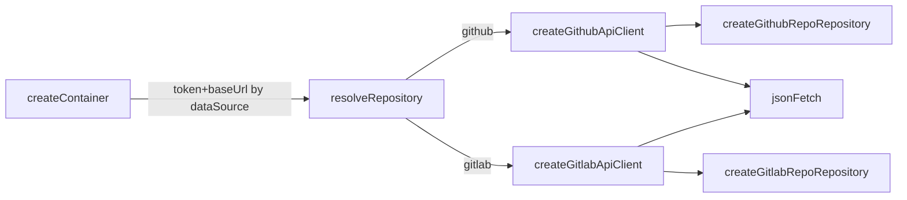

# Infra HTTP Clients & Host — Design (inline)

**Spec**: `.specs/features/infra-http-clients/spec.md`  
**Context**: `.specs/features/infra-http-clients/context.md`  
**Status**: Approved (inline + review fixes 2026-08-02)

---

## Architecture Overview

Split cada provedor em **ApiClient** (transport: host normalize + Bearer + `jsonFetch`) e **RepoRepository** (ACL: assert, map, paginação). DI espelha `tokens` com `hosts`.



**Dependency Rule:** Client e repo ficam em `infrastructure/{github|gitlab}/`. Application/domain inalterados.

---

## Components

### Shared: resolve API base URL

- **Where**: small helper colocated or `src/infrastructure/http/resolve-api-base-url.ts`
- **GitHub**: omit → `https://api.github.com`; custom → use as API origin (no `/api/v4` logic)
- **GitLab** (`normalizeGitlabApiBase`):
  1. omit → `https://gitlab.com/api/v4`
  2. parse input as URL; strip trailing `/`
  3. if pathname is empty or `/` → append `/api/v4`
  4. if pathname already ends with `/api/v4` → keep
  5. otherwise append `/api/v4` to origin+path (so `https://host/gitlab` → `https://host/gitlab/api/v4` — agent: prefer origin-only append when path empty; if path non-empty and not `/api/v4`, append `/api/v4` to full href without trailing slash)
- **Join paths**: `new URL(relativePath.replace(/^\//, ''), baseWithTrailingSlash)` where `baseWithTrailingSlash = normalizedBase.endsWith('/') ? normalizedBase : normalizedBase + '/'` — **never** string concat of host+path

> Locked choice (review): GitLab client **owns** `/api/v4` normalization for DX (accept root **or** full API base). Not a strict “DI must pass full API URL” contract.

### `jsonFetch` (slim)

- **Where**: `src/infrastructure/http/json-fetch.ts`
- **Change**: Auth só Bearer quando `token` presente — remover `tokenHeader` / `private-token`
- **Used by**: ApiClients only

### GitHub ApiClient

- **Where**: `src/infrastructure/github/create-github-api-client.ts`
- **Factory**: `createGithubApiClient({ baseUrl?, token? })`
- **Methods** (DTO + headers):
  - `searchRepositories({ query, page, perPage })`
  - `getRepository(ownerRepo: string)`
  - `listOpenIssues(ownerRepo, { page, perPage })`
- Builds absolute URLs via `new URL(...)` against normalized GH base

### GitLab ApiClient

- **Where**: `src/infrastructure/gitlab/create-gitlab-api-client.ts`
- **Factory**: `createGitlabApiClient({ baseUrl?, token? })`
- **Normalize** via GitLab rules above before any request
- **Methods**: `searchProjects`, `getProject`, `listOpenedIssues`
- **Auth**: Bearer only

### Repositories (ACL)

- Receive `{ client }` from DI
- **Must not** import `jsonFetch` or call `fetch`
- Mapping / Fail Fast / `hasNextPage` unchanged (GH 1000 cap)

### DI

```typescript
type ProviderHosts = { github?: string; gitlab?: string };

type CreateContainerDeps = {
  dataSource: DataSource;
  repository?: RepoRepository;
  tokens?: ProviderTokens;
  hosts?: ProviderHosts;
};

type ResolveRepositoryOptions = {
  token?: string;
  baseUrl?: string;
};
```

`resolveRepository(dataSource, { token, baseUrl })` → create client → create repo `{ client }`.

### Tests / MSW

| Layer | Approach |
| ----- | -------- |
| ApiClient | MSW with **path wildcards** (e.g. `*/search/repositories`, `*/api/v4/projects`, `*/projects/:id`) so custom hosts still match; assert Bearer + final URL host/path |
| GitLab normalize | Unit: root → `.../api/v4`; already `/api/v4` → no double |
| Repository | Existing gates; PRIVATE-TOKEN asserts → Bearer |
| Isolation | Repo files must not match `jsonFetch` / `\bfetch\b` |
| `jsonFetch` | Drop private-token cases |

**Anti-pattern:** absolute-only handlers for default hosts when testing custom `baseUrl` → unhandled request / real network.

---

## Error Handling

Unchanged — client → `jsonFetch` → existing classifiers.

---

## Risks & Concerns

| Concern | Mitigation |
| ------- | ---------- |
| PRIVATE-TOKEN tests | Rewrite to Bearer |
| MSW absolute URLs | Wildcards / host-agnostic patterns (CLI-07) |
| Slash bugs | `URL` API only (CLI-06) |
| Double `/api/v4` | Explicit endsWith check (CLI-03) |
| Subpath GitLab install | Normalize appends `/api/v4` to given base path; document in README if needed |

---

## Tech Decisions

| Decision | Choice | Rationale |
| -------- | ------ | --------- |
| GL host contract | Client normalizes `/api/v4` | DX on-prem (review) |
| URL join | `new URL` | Review gap 3 |
| MSW | Wildcard paths | Review gap 2 |
| Repo receives `client` | Yes | CLI-04/05 |
| Hosts bag | Mirror tokens | CLI-09 |
| jsonFetch | `token?` → Bearer only | CLI-12 |

> **Project-level:** **AD-023** — ApiClients (host normalize + Bearer); repos ACL-only; DI `hosts?`.

---

## Requirement mapping

| IDs | Component |
| --- | --------- |
| CLI-01, CLI-06, CLI-12 | GH client + jsonFetch + URL |
| CLI-02, CLI-03, CLI-06, CLI-12 | GL client normalize + Bearer |
| CLI-04, CLI-05, CLI-08, CLI-11 | Repos + MSW gates |
| CLI-07 | MSW wildcard harness/tests |
| CLI-09, CLI-10 | DI hosts |

**Coverage:** 12/12
