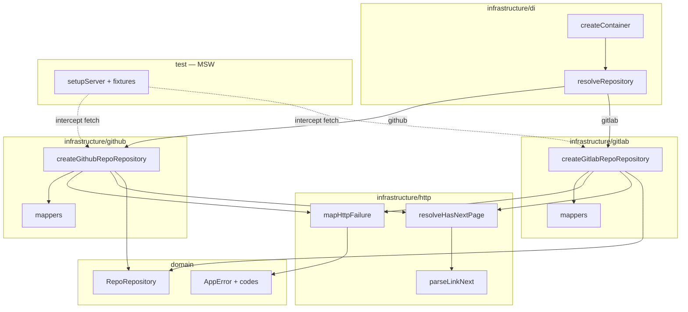

# Infrastructure Layer Design

**Spec**: `.specs/features/infrastructure-layer/spec.md`  
**Context**: `.specs/features/infrastructure-layer/context.md`  
**Status**: Approved (Approach A)

---

## Approach exploration (Large)

| Approach | Summary | Pros | Cons |
| -------- | ------- | ---- | ---- |
| **A — Shared HTTP kit + adapters por provedor (chosen)** | `http/` compartilhado + `github/` / `gitlab/` (factory + mappers) + DI HTTP + MSW | AD-002; classificador único; fetch nativo | Mais arquivos; Jest+MSW precisa setup |
| B — Cliente HTTP injetável | Porta `HttpClient` | Stub fácil | Contradiz context E |
| C — Monolitos por provedor | Dois arquivos gordos | Diff inicial menor | Duplicação erro/paginação |

**Recommendation locked: A** (user confirmed 2026-08-02).

---

## Architecture Overview

Anti-Corruption Layer na infrastructure: cada provedor implementa `RepoRepository` com `fetch` nativo, DTOs + mappers próprios, e um kit HTTP compartilhado para status → `AppError` e `hasNextPage`. O composition root injeta token opcional e deixa de usar Fake em runtime.



**Dependency Rule:** `infrastructure` → `domain` + `application` (`DataSource` only). Adapters **não** importam React/Zustand/Query. Application **não** importa adapters HTTP.

---

## Code Reuse Analysis

### Existing Components to Leverage

| Component | Location | How to Use |
| --- | --- | --- |
| `RepoRepository` + entities | `src/domain/**` | Contrato e shapes de saída dos mappers |
| `createAppError` / `isAppError` | `src/domain/errors/app-error.ts` | Estender codes; classificador chama factory |
| `resolveRepository` map | `src/infrastructure/di/resolve-repository.ts` | Trocar factories Fake → HTTP |
| `createContainer` | `src/infrastructure/di/create-container.ts` | Estender deps com tokens opcionais |
| In-memory Fake | `src/infrastructure/repositories/in-memory-repo-repository.ts` | Manter export; remover do map de resolve |
| Isolation / public-api tests | `src/domain|infrastructure/__tests__/*` | Atualizar + espelhar scan de adapters |
| Jest setup | `jest.config.ts`, `src/test/setup.ts` | Hook MSW lifecycle; export conditions |

### Integration Points

| System | Integration Method |
| --- | --- |
| GitHub REST | `fetch` → `https://api.github.com` |
| GitLab REST | `fetch` → `https://gitlab.com/api/v4` |
| MSW | `setupServer` intercepta nos testes de adapter |
| `@/infrastructure` barrel | Export factories HTTP + Fake + DI |
| Presentation / token UI | **Deferred** — DI contract is `tokens?` bag |

---

## Components

### Domain: `AppErrorCode` extension

- **Purpose**: Taxonomia única para 401/403/abort.
- **Location**: `src/domain/errors/app-error.ts` (+ testes)
- **Interfaces**: union += `'unauthorized' | 'forbidden' | 'aborted'`
- **Dependencies**: none
- **Reuses**: `createAppError` / `isAppError` existentes

### Shared: `mapHttpFailure`

- **Purpose**: Traduz falha de `fetch`/Response → `AppError`.
- **Location**: `src/infrastructure/http/map-http-failure.ts`
- **Interfaces**:
  - `mapHttpStatus(status: number, cause?: unknown): AppError`
  - `mapFetchException(error: unknown): AppError` (`AbortError` → `aborted`; resto de rede → `network`)
  - `mapHttpResponseError(response: Response): Promise<AppError>` / sync variant — for non-OK responses, especially `429`, builds structured `cause`
- **Status map**: `401→unauthorized`, `403→forbidden`, `404→not_found`, `429→rate_limit`, else → `unknown`
- **429 cause** (infra-documented shape, stored in `AppError.cause`):

```typescript
type RateLimitCause = {
  status: 429;
  /** Unix epoch seconds when present (GitHub `X-RateLimit-Reset`). */
  resetAtEpochSeconds?: number;
  /** Seconds to wait when present (`Retry-After`). */
  retryAfterSeconds?: number;
};
```

- **Dependencies**: `@/domain`
- **Reuses**: `createAppError`

### Shared: pagination helpers

- **Purpose**: `hasNextPage` híbrido **agnóstico a provedor** (headers → fallback length; empty → false; optional pre-resolved flag).
- **Location**:
  - `src/infrastructure/http/parse-link-next.ts` — `hasRelNext(linkHeader: string | null): boolean`
  - `src/infrastructure/http/resolve-has-next-page.ts` — `resolveHasNextPage(input): boolean`
- **Interfaces**:

```typescript
type ResolveHasNextPageInput = {
  itemsLength: number;
  perPage: number;
  /** Prefer when known (GitHub Link rel=next, GitLab X-Next-Page non-empty). */
  headerIndicatesNext?: boolean;
  /**
   * Caller-resolved next flag (e.g. GitHub search after applying total_count cap).
   * When defined, wins over headers/length fallback. No totalCount knowledge here.
   */
  resolvedHasNext?: boolean;
};
```

- **Rules**: `itemsLength === 0` → `false`; else if `resolvedHasNext` defined → use it; else if `headerIndicatesNext` defined → use it; else `itemsLength === perPage`
- **Dependencies**: none (pure)
- **Reuses**: context D (revised)

### Shared: request helper (thin, not injectable client)

- **Purpose**: Um `jsonFetch` interno que aplica headers, parseia JSON, e delega erros ao classificador — **não** é porta injetável; existe só para DRY entre adapters.
- **Location**: `src/infrastructure/http/json-fetch.ts`
- **Interfaces**:
  - `jsonFetch<T>(url: string, init?: RequestInit & { token?: string; tokenHeader?: 'bearer' | 'private-token' }): Promise<{ data: T; headers: Headers }>`
  - On non-OK: throw `mapHttpStatus`
  - On catch: throw `mapFetchException`
- **Dependencies**: `mapHttpFailure` helpers
- **Reuses**: native `fetch` only

### GitHub adapter

- **Purpose**: `RepoRepository` para GitHub.
- **Location**:
  - `src/infrastructure/github/create-github-repo-repository.ts`
  - `src/infrastructure/github/mappers.ts` (ou `map-repo.ts` / `map-issue.ts`)
  - `src/infrastructure/github/types.ts` (DTOs mínimos)
  - `src/infrastructure/github/assert-repo-id.ts` — Fail Fast `/`
- **Interfaces**:
  - `createGithubRepoRepository(options?: { token?: string }): RepoRepository`
- **Endpoints**:
  - Search: `GET /search/repositories?q=&sort=stars&order=desc&page=&per_page=`
  - Detail: `GET /repos/{owner}/{repo}`
  - Issues: `GET /repos/{owner}/{repo}/issues?state=open&page=&per_page=`
- **Auth**: `Authorization: Bearer <token>` quando `token` presente
- **ID**: `full_name` → `Repo.id`; split `owner/repo` para paths
- **Search hasNextPage**: compute in GitHub mapper/adapter  
  `resolvedHasNext = (page * perPage) < Math.min(total_count, 1000)`  
  then `resolveHasNextPage({ itemsLength, perPage, resolvedHasNext })` — **never** pass `total_count` into the shared helper
- **List hasNextPage**: `Link` rel=next → hybrid helper
- **Dependencies**: http kit + `@/domain`
- **Reuses**: porta + entities

### GitLab adapter

- **Purpose**: `RepoRepository` para GitLab.
- **Location**: espelho sob `src/infrastructure/gitlab/`
- **Interfaces**:
  - `createGitlabRepoRepository(options?: { token?: string }): RepoRepository`
- **Endpoints** (enunciado):
  - `GET /projects?search=&order_by=star_count&sort=desc&page=&per_page=`
  - `GET /projects/{id}`
  - `GET /projects/{id}/issues?state=opened&page=&per_page=`
- **Auth**: `PRIVATE-TOKEN: <token>` quando presente
- **ID**: `String(project.id)`; Fail Fast se `repoId` não match `/^\d+$/`
- **hasNextPage**: `X-Next-Page` non-empty → true; hybrid fallback
- **Dependencies**: http kit + `@/domain`
- **Reuses**: mesma forma factory do GitHub

### Field mapping (null → undefined)

| Domain | GitHub | GitLab |
| ------ | ------ | ------ |
| `Repo.id` | `full_name` | `String(id)` |
| `name` | `name` | `name` / path last segment |
| `fullName` | `full_name` | `path_with_namespace` |
| `description` | `description` null→undefined | idem |
| `stars` | `stargazers_count` | `star_count` |
| `forks` | `forks_count` | `forks_count` |
| `watchers` | `watchers_count` / `subscribers_count` (prefer stargazers-adjacent; use `watchers_count` se presente) | `0` ou campo mais próximo se existir — **agent**: prefer `statistics` omit → `0` se API lista não traz watchers |
| `language` | `language` | omit/null → undefined (projects API often lacks; detail may too) |
| `ownerName` | `owner.login` | namespace path first segment / `namespace.name` |
| `ownerAvatarUrl` | `owner.avatar_url` | `namespace.avatar_url` / owner avatar |
| `htmlUrl` | `html_url` | `web_url` |
| `Issue.id` | `String(id)` | `String(id)` |
| `number` | `number` | `iid` |
| `authorName` | `user.login` | `author.username` |
| `labels` | `labels[]` `{id,name,color}` | `labels[]` string[] → synthesize id=name, color undefined |
| `createdAt` | `created_at` | `created_at` |
| `htmlUrl` | `html_url` | `web_url` |

> Watchers/language gaps on GitLab list: map to `0` / `undefined` rather than inventing HTTP extra calls (N+1 out of scope).

### DI updates

- **`resolveRepository(dataSource, options?: { token?: string })`**  
  - Map: `github → createGithubRepoRepository`, `gitlab → createGitlabRepoRepository`  
  - Pass **already-selected** `token` through  
  - **No** Fake in this map

- **`CreateContainerDeps`**:

```typescript
type ProviderTokens = {
  github?: string;
  gitlab?: string;
};

type CreateContainerDeps = {
  dataSource: DataSource;
  repository?: RepoRepository; // test override
  /** Optional credentials bag — DI selects token for active dataSource. */
  tokens?: ProviderTokens;
};
```

- Wiring: `const token = deps.tokens?.[deps.dataSource]; resolveRepository(deps.dataSource, { token })` unless override
- Presentation injects the whole bag (session state); does **not** pick github vs gitlab string on each recreate

### MSW test harness

- **Purpose**: Interceptar rede nos testes de `jsonFetch` e adapters.
- **Location**:
  - `src/test/msw/server.ts` — `setupServer()`
  - `src/test/msw/handlers/github.ts` / `gitlab.ts` — defaults opcionais
  - `src/test/msw/fixtures/github/*.json` / `gitlab/*.json`
  - Lifecycle **suite-scoped** in http/adapter tests (shared helper)
- **Jest config**:
  - Add `msw` (+ `jest-fixed-jsdom` **if** `jest-expo` breaks `msw/node`; else `testEnvironmentOptions.customExportConditions: ['']`)
  - Transform allowlist for `msw` packages if needed
- **Order**: MSW harness lands **before** `jsonFetch` tests — **no** transitional `global.fetch` mock
- **Gate tests**: github/gitlab repository suites + jsonFetch suite via MSW
- **Complementary**: pure unit tests for `mapHttpFailure` / `resolveHasNextPage` / mappers allowed but **not** sole gate for adapters

### Barrels & Fake

- `@/infrastructure` exports: DI + Fake + `createGithubRepoRepository` + `createGitlabRepoRepository` (test/DI convenience)
- Fake remains for use-case tests only
- Update `resolve-repository.test.ts`: assert HTTP adapters (e.g. invalid id Fail Fast without network, or MSW identity)

### Isolation scan

- Extend / add `src/infrastructure/__tests__/isolation.test.ts`: adapters + http **must not** import React, RN UI, Zustand, TanStack Query, styled-components
- Domain isolation unchanged (+ new codes in app-error tests)

---

## Data Models

### Adapter options

```typescript
type HttpRepoRepositoryOptions = {
  token?: string;
};
```

### GitHub search DTO (minimal)

```typescript
type GithubSearchReposResponse = {
  total_count: number;
  items: GithubRepoDto[];
};
```

### Paginated domain result (unchanged)

```typescript
type PaginatedResult<T> = {
  items: T[];
  page: number;
  perPage: number;
  hasNextPage: boolean;
};
```

**Relationships:** DTOs vivem só em `infrastructure/{github|gitlab}/`; nunca exportados no barrel público de domínio.

---

## Error Handling Strategy

| Error Scenario | Handling | User Impact |
| -------------- | -------- | ----------- |
| `repoId` formato inválido no adapter | `invalid_input` sem HTTP | UI depois |
| 401 / 403 / 404 | codes dedicados | UI depois |
| 429 rate limit | `rate_limit` + `RateLimitCause` em `cause` | UI pode mostrar “tente em X” |
| AbortError | `aborted` | Query cancel (depois) |
| TypeError/network | `network` | UI depois |
| 5xx / JSON inválido | `unknown` + `cause` | UI depois |
| Campo null da API | mapper → `undefined` | transparente |

---

## Risks & Concerns

| Concern | Location | Impact | Mitigation |
| ------- | -------- | ------ | ---------- |
| MSW + jest-expo export conditions / missing fetch globals | `jest.config.ts`, `src/test/setup.ts` | Suite infra vermelha ou `msw/node` unresolved | Task de setup dedicada; `customExportConditions` / `jest-fixed-jsdom`; documentar no design Execute notes |
| GitLab list sem `language` / watchers | mappers GL | Campos vazios vs GH | Map `undefined`/`0`; sem N+1 |
| GitHub issues endpoint inclui PRs | `GET .../issues` | Issues “sujas” | Aceito nesta fatia (API padrão); filtro PR = deferred |
| Token em memória via DI | `createContainer` | Sem persist ainda | Deferred credentials; não logar token |
| Testes DI atuais assumem Fake `not_found` | `resolve-repository.test.ts` | Quebra | Reescrever com MSW ou Fail Fast `invalid_input` |
| `ALL_CODES` length 6 hardcoded | `app-error.test.ts` | Falha INFRA-01 | Atualizar para 9 codes |
| README ainda cita `GITHUB_TOKEN` env | `README.md` | Docs desalinhados | Ajuste mínimo nesta feature ou defer credentials — agent: touch README se AD-021 |

---

## Tech Decisions (non-obvious)

| Decision | Choice | Rationale |
| -------- | ------ | --------- |
| Layout | `http/` + `github/` + `gitlab/` | Separação ACL clara; shared classifier |
| Thin `jsonFetch` | Internal helper, not injectable port; tested with MSW (harness first) | DRY sem contradizer context E |
| GitHub auth header | `Authorization: Bearer` | Docs REST atuais |
| GitLab auth header | `PRIVATE-TOKEN` | Enunciado/token pessoal comum; simples |
| DI tokens | `tokens?: { github?: string; gitlab?: string }` | Presentation injects bag; DI picks by dataSource |
| GH search cap | `Math.min(total_count, 1000)` inside GH mapper | Avoid false hasNext beyond Search API window |
| Pagination helper | `resolvedHasNext?` only — no totalCount field | Keep http kit provider-agnostic |
| MSW before jsonFetch | Task order: harness → jsonFetch | No provisional global.fetch mock |
| MSW lifecycle | Prefer suite-scoped (adapter/http tests) | Menos interferência em testes DS/UI |
| GitLab watchers/language | `0` / `undefined` sem fetch extra | Evita N+1; contrato opcional tolera |
| `resolveRepository` 2º arg | `{ token?: string }` já selecionado | Encaminha auth sem Zustand |
| Search GH pagination | Cap + boolean into shared helper | Context D revised / INFRA-05/35 |

> **Project-level:** Append **AD-021** (supersedes AD-008) — tokens opcionais como **mapa por fonte** no DI; sem `.env` como fonte. Append **AD-022** — adapters HTTP nativos por provedor + MSW; Fake fora do `resolveRepository` runtime.

---

## Requirement mapping (design → IDs)

| IDs | Design component |
| --- | ---------------- |
| INFRA-01..03 | Domain AppErrorCode + isolation |
| INFRA-04..11, INFRA-35 | GitHub adapter + mappers + pagination + token + resolvedHasNext |
| INFRA-12..18 | GitLab adapter + mappers + pagination + token |
| INFRA-19..26 | `mapHttpFailure` / `jsonFetch` classifier (+ rate limit cause) |
| INFRA-27..32 | DI resolve/createContainer tokens map + Fake out of runtime |
| INFRA-33..34 | Barrel + adapter isolation |

**Coverage after design:** 35/35 mapped to components (tasks TBD)

---

## AD impact

| Decision | Action |
| -------- | ------ |
| AD-008 | **Superseded by AD-021** |
| AD-020 | Continua ativo; Fake permanece para testes; runtime HTTP via AD-022 |
| AD-002 / AD-001 | Conform — um branch em `resolveRepository`, mappers isolados |
