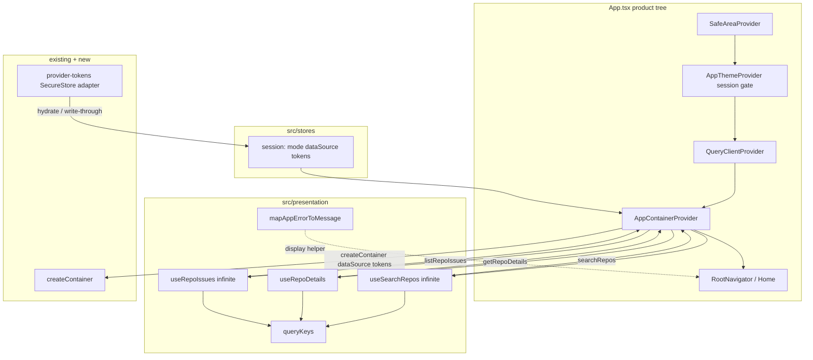

# Presentation Layer (Bridge) Design

**Spec**: `.specs/features/presentation-layer/spec.md`  
**Context**: `.specs/features/presentation-layer/context.md`  
**Status**: Approved (Approach A + SecureStore)

---

## Approach exploration (Large)

| Approach | Summary | Pros | Cons |
| -------- | ------- | ---- | ---- |
| **A — Composition under `src/presentation/` (recommended)** | Providers + queryKeys + hooks + error mapper; session `tokens` + **SecureStore** adapter; App.tsx monta a árvore | Honra context; DI imutável; `queryKey` isola fonte; segredos no Keychain/Keystore | Mais arquivos; gate de hydrate duplo; mock SecureStore nos testes |
| B — Hooks chamam `createContainer` direto | Menos Context | Service Locator; recria container por hook; quebra AD-020 | Spec PRES-01/02 falham |
| C — Mega `AppProviders` sem pasta `presentation/` | Menos nesting visual | Quebra simetria pedida no discuss | Context §1 rejeita |

**Recommendation: A.** Decisions do context + design review (SecureStore) fixam pastas, infinite query, key-only isolation e persistência de tokens.

---

## Architecture Overview

**Presentation** = casca React: lê sessão (`dataSource` + `tokens`), recria `AppContainer`, expõe use cases via TanStack Query.  
**Tokens** = memória no Zustand + durable em **`expo-secure-store`** (nunca AsyncStorage).  
**Sem** `if (provider)` em hooks; **sem** invalidate no toggle de fonte; **sem** UI de token nesta fatia.



**Dependency Rule (esta fatia):**

- `presentation` → `stores`, `@/infrastructure` (`createContainer` / SecureStore adapter / tipos), `@/application` (`DataSource`), `@/domain` (`isAppError`) + TanStack/React
- `infrastructure/di` continua **sem** React/Zustand
- Hooks **não** importam `github/` / `gitlab/` / `fetch`

---

## Code Reuse Analysis

### Existing Components to Leverage

| Component | Location | How to Use |
| --- | --- | --- |
| `createContainer` / `ProviderTokens` / `AppContainer` | `src/infrastructure/di/create-container.ts` | Provider chama com `{ dataSource, tokens }`; testes podem passar `repository?` |
| Session store + prefs persist | `src/stores/session-preferences-store.ts` | `tokens` + setters; `partialize` só mode/dataSource; `reset()` limpa SecureStore tokens |
| SecureStore (new) | `expo-secure-store` via infrastructure adapter | Persist/hydrate provider tokens — [SDK 54](https://docs.expo.dev/versions/v54.0.0/sdk/securestore/) |
| `AppThemeProvider` hydrate gate | `src/components/ds/theme/AppThemeProvider.tsx` | Estender readiness: prefs **e** tokens SecureStore antes de pintar filhos |
| `DEFAULT_PAGE` / `DEFAULT_PER_PAGE` | `src/application/constants/pagination.ts` | `initialPageParam = DEFAULT_PAGE` |
| `PaginatedResult.hasNextPage` | `src/domain/entities/pagination.ts` | `getNextPageParam`: `hasNextPage` → `page + 1` |
| Isolation scan pattern | `src/application\|infrastructure/__tests__/isolation.test.ts` | Clonar para presentation hooks |
| Test render helpers | `src/test/render.tsx` | Query + Container + Fake; mock SecureStore |
| Home tests | `src/screens/__tests__/HomeScreen.test.tsx` | Continuam verdes após wiring P2 |
| Object-map style (AD-013) | DS tokens | Mapper = `Record<AppErrorCode, string>` |

### Integration Points

| System | Integration Method |
| --- | --- |
| Zustand session | Selectors `dataSource`, `tokens`; gate flags |
| SecureStore | Adapter load/save/clear; `isAvailableAsync` guard |
| TanStack Query | `@tanstack/react-query`; factory no provider |
| DI | Só via `createContainer` no `AppContainerProvider` |
| Future screens | Hooks sob `presentation/hooks` |
| Storybook | Sem providers de produto no entry atual |

---

## Components

### `queryKeys` (factory tipada)

- **Purpose**: Prefixos estáveis; sempre incluem `dataSource`.
- **Location**: `src/presentation/query-keys.ts`
- **Interfaces**:
  - `queryKeys.repos.search(dataSource, query)` → `readonly ['repos', DataSource, 'search', string]`
  - `queryKeys.repos.detail(dataSource, repoId)` → `readonly ['repos', DataSource, 'detail', string]`
  - `queryKeys.repos.issues(dataSource, repoId)` → `readonly ['repos', DataSource, 'issues', string]`
- **Dependencies**: `DataSource` from `@/application`

### `createQueryClient` / `AppQueryProvider`

- **Purpose**: `QueryClient` com defaults conservadores.
- **Location**: `src/presentation/providers/AppQueryProvider.tsx` (+ optional `create-query-client.ts`)
- **Interfaces**:
  - `createQueryClient(): QueryClient` — `staleTime: 60_000`, `retry: false`
  - `AppQueryProvider({ children, client? })`
- **Note**: **Nenhum** `invalidateQueries` / `removeQueries` no toggle de fonte

### Provider-tokens SecureStore adapter

- **Purpose**: Anti-corruption em torno de `expo-secure-store` para o bag de tokens.
- **Location**: `src/infrastructure/secure-store/provider-tokens-secure-store.ts` (nome final agent discretion)
- **Interfaces**:
  - `loadProviderTokens(): Promise<ProviderTokens>`
  - `saveProviderToken(dataSource, token: string | undefined): Promise<void>` — `undefined`/empty → `deleteItemAsync`
  - `clearProviderTokens(): Promise<void>`
- **Rules**:
  - Guard com `SecureStore.isAvailableAsync()` — se false, load `{}`, writes no-op
  - Keys constantes tipadas (ex. `searchrepos.token.github` / `searchrepos.token.gitlab`) — charset permitido pela API
  - `requireAuthentication: false` nesta fatia
  - Catch erros nativos (size/platform) — não derrubar o app; preferir falhar closed para aquele write
- **Install**: `npx expo install expo-secure-store` (SDK 54); plugin em `app.json`; considerar `ios.config.usesNonExemptEncryption: false`
- **Dependencies**: `expo-secure-store`, `ProviderTokens`, `DataSource`
- **Export**: barrel `@/infrastructure` se útil a testes

### Session store — `tokens` + SecureStore write-through

- **Purpose**: Bag em memória para o DI; durable via adapter.
- **Location**: `src/stores/session-preferences-store.ts` (extend)
- **Interfaces**:
  - `tokens: ProviderTokens` — default `{}`
  - `setTokens` / `setToken` — memória **e** SecureStore write-through
  - `hasTokensHydrated: boolean` (ou flag unificada) — não persistida
  - `hydrateTokensFromSecureStore()` (ou bootstrap chamado no gate) — load → `setState` **sem** re-gravar
  - `reset()` — limpa memória tokens + `clearProviderTokens()` + prefs `clearStorage`
- **Persist prefs**: `partialize` = **apenas** `{ mode, dataSource }`
- **Dependencies**: SecureStore adapter, `ProviderTokens`, `DataSource`

### Session gate (prefs + tokens)

- **Purpose**: Evitar flash anônimo→autenticado.
- **Location**: estender `AppThemeProvider` / `useHydration` (ou `useSessionReady`)
- **Rule**: children de produto só após prefs `hasHydrated` **e** tokens SecureStore ready (sucesso ou fallback vazio)
- **Reuses**: splash hide atual após ready

### `AppContainerProvider` + `useAppContainer`

- **Purpose**: Composition root React; recria container quando `dataSource` ou `tokens` mudam.
- **Location**: `src/presentation/providers/AppContainerProvider.tsx`
- **Interfaces**:
  - Props: `{ children; repository?: RepoRepository }`
  - `useAppContainer(): AppContainer` — throw fora do provider
- **Implementation**: `useMemo(() => createContainer({ dataSource, tokens, repository }), [...])` sob o gate
- **Dependencies**: `@/infrastructure`, session store, React context

### Hooks (`useSearchRepos` / `useRepoDetails` / `useRepoIssues`)

- **Location**: `src/presentation/hooks/`
- **Search / issues**: `useInfiniteQuery`; `initialPageParam: DEFAULT_PAGE`; `getNextPageParam` via `hasNextPage`
- **Details**: `useQuery`
- **Keys**: sempre com `dataSource`
- **enabled**: trim não-vazio por default
- **Sem** imports github/gitlab/fetch

### `mapAppErrorToMessage`

- **Location**: `src/presentation/errors/map-app-error-to-message.ts`
- **Pure** PT-BR map por `AppErrorCode`; ignora `cause` de rate_limit

### App entry wiring (P2)

- **Tree**: `SafeArea` → `AppThemeProvider` (gate) → `AppQueryProvider` → `AppContainerProvider` → `RootNavigator`
- Storybook entry inalterado

### Test harness

- Mock `expo-secure-store` (in-memory map)
- Suites: SecureStore persist/restore/unavailable/reset; partialize excludes tokens; provider; hooks; mapper; isolation
- `AllTheProviders`: Query + Container + Fake opcional

### Barrel (optional)

- `src/presentation/index.ts` — providers, hooks, queryKeys, mapper

---

## Data Models

### Session tokens (memory + SecureStore)

```typescript
import type { ProviderTokens } from '@/infrastructure';

type SessionPreferencesState = {
  // ...existing mode / dataSource / hasHydrated
  tokens: ProviderTokens;
  hasTokensHydrated: boolean;
  setTokens: (tokens: ProviderTokens) => void;
  setToken: (dataSource: DataSource, token: string | undefined) => void;
};
```

**Relationships**: SecureStore → hydrate → store bag → `createContainer({ tokens })` → DI picks `tokens[dataSource]`.

### Query key tuples

```typescript
type SearchKey = readonly ['repos', DataSource, 'search', string];
type DetailKey = readonly ['repos', DataSource, 'detail', string];
type IssuesKey = readonly ['repos', DataSource, 'issues', string];
```

### Infinite page param

- `pageParam: number` starting at `DEFAULT_PAGE` (1)
- Page payload = `PaginatedResult<T>` unchanged

---

## Error Handling Strategy

| Error Scenario | Handling | User Impact |
| --- | --- | --- |
| Use case `AppError` | Query `error`; UI usa mapper | String PT-BR |
| Non-AppError | Mapper → `unknown` | Genérico |
| `rate_limit` + `cause` | Ignora `cause` | Copy estática |
| SecureStore read/write fail | Fallback empty / keep memory; still mark hydrated | Anônimo; sem crash |
| SecureStore unavailable (web) | Adapter no-op | Tokens só na sessão |
| Token cleared | `deleteItemAsync` + bag | Requests anônimas |
| Hook fora do provider | Throw | Fail fast |
| Empty query/repoId | `enabled: false` | Sem fetch |
| Toggle fonte mid-flight | Nova queryKey | Cache antigo preservado |

---

## Risks & Concerns

| Concern | Location | Impact | Mitigation |
| --- | --- | --- | --- |
| TanStack ausente | `package.json` | Bloqueio | Add `@tanstack/react-query` v5 |
| `retry` default | QueryClient | Martela 429 | `retry: false` |
| Tokens em AsyncStorage | store partialize | Segredo em claro | Excluir do partialize + teste; SecureStore only (AD-024) |
| SecureStore size/errors | iOS historical ~2KB | Write reject | Tokens curtos; catch |
| Gate só prefs | Theme provider | Flash anônimo | Esperar tokens hydrate também |
| SDK drift | deps | API errada | `expo install` pinado SDK 54 |
| `AllTheProviders` stale | `src/test/render.tsx` | Testes vermelhos | Atualizar harness |
| `tokens` mutate in-place | store setters | Container stale | Sempre novo objeto |

---

## Tech Decisions (non-obvious)

| Decision | Choice | Rationale |
| --- | --- | --- |
| Provider order | Theme (gate) → Query → Container → Nav | Gate cobre produto |
| Query defaults | `staleTime: 60s`, `retry: false` | Cache A→B→A; sem retry AppError |
| Hook return | Thin TanStack result | Telas fazem flatten |
| Test override | `repository?` no provider | Fake real via DI |
| Token durable storage | `expo-secure-store` | Keystore/Keychain — [docs v54](https://docs.expo.dev/versions/v54.0.0/sdk/securestore/) |
| SecureStore biometrics | off this slice | Expo Go / gate simples |
| Token hydrate | Com prefs no gate | Sem flash |
| Mapper path | `src/presentation/errors/` | Puro |
| No invalidate on toggle | Locked | AD-023 |

### Project-level → STATE

- **AD-023**: `src/presentation/` + queryKey com `dataSource` + sem invalidate no toggle; bag `tokens` em memória para DI.
- **AD-024**: Tokens só via `expo-secure-store`; nunca AsyncStorage/partialize; gate espera hydrate; UI de token deferred.

---

## Requirement mapping (design)

| ID | Design component |
| --- | --- |
| PRES-01..05, 05b–05g | AppContainerProvider + session tokens + SecureStore adapter + gate |
| PRES-06..12, 19 | AppQueryProvider + hooks + queryKeys |
| PRES-13..16 | mapAppErrorToMessage |
| PRES-17..18 | App.tsx + Home harness |
| PRES-04, 11 | isolation tests |

---

## References

- TanStack Query v5 infinite queries — [docs](https://tanstack.com/query/latest/docs/framework/react/guides/infinite-queries)
- Expo SecureStore SDK 54 — [docs](https://docs.expo.dev/versions/v54.0.0/sdk/securestore/)
- AD-001, AD-002, AD-005, AD-013, AD-020, AD-021, AD-023, AD-024
- Follow-ups: `NEXT.md`
