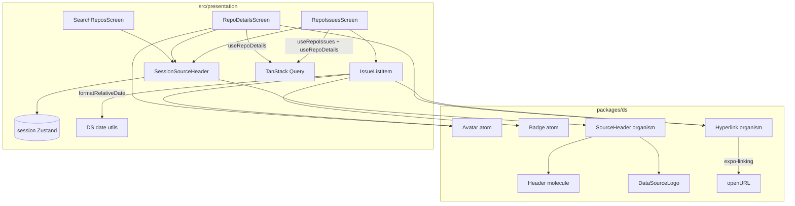

# Repo Details & Issues Design

**Spec**: `.specs/features/repo-details-issues/spec.md`  
**Context**: `.specs/features/repo-details-issues/context.md`  
**Status**: Approved

---

## Approach exploration (Large)

| Approach | Summary | Pros | Cons |
| -------- | ------- | ---- | ---- |
| **A — DS primitives + thin screens (recommended)** | Avatar, Badge, Hyperlink, SourceHeader no DS; screens consume hooks; `SessionSourceHeader` in `presentation/components` wires store; Issues gets repo `htmlUrl` via `useRepoDetails` (cache hit after Details) | Honra AD-009/012/027; DS isolado (DSLIB-02); reusa hooks; nav params inalterados | Extra query em Issues se cache frio |
| B — Pass `htmlUrl` in nav params | `RepoIssues: { repoId, htmlUrl }` | Zero fetch extra | Params inchados; stale se URL mudar; fura “id opaco” |
| C — Fat screen organisms no DS | Details/Issues como organisms com data props grandes | Catálogo Storybook rico | DS não deve conhecer domínio `Repo`/`Issue`; viola isolamento e Atomic Design do produto |

**Recommendation: A.** Context já trava Hyperlink/SourceHeader como organismos store-free e wiring em presentation.

---

## Architecture Overview



**Flow:** Search (SessionSourceHeader + lista polish) → Details (`useRepoDetails`, hero, metrics, Hyperlink repo, CTA) → Issues (`useRepoIssues` + `useRepoDetails` para Hyperlink do repo, cards com Hyperlink da issue).

**Visual (dentro do DS — frontend-design restraint):** sem nova paleta; hierarquia Search = Spacer entre Header/Input/lista; rows Card com caption muted para meta; Details hero = Avatar lg + Typography heading; metrics row = caption labels + body numbers; Issues = densididade Card igual Search.

---

## Code Reuse Analysis

### Existing Components to Leverage

| Component | Location | How to Use |
| --------- | -------- | ---------- |
| `Header` | `packages/ds/molecules/Header` | Composição interna de `SourceHeader` (title + trailing) |
| `DataSourceLogo` | `packages/ds/organisms/DataSourceLogo` | Trailing do `SourceHeader` |
| `Typography` / `Button` / `Loading` / `Card` / `Container` / `Spacer` | `@ds/*` | Telas + polish Search |
| `useRepoDetails` / `useRepoIssues` | `src/presentation/hooks/` | Screens — sem novos hooks de fetch |
| `mapAppErrorToMessage` | `src/presentation/errors/` | Error + Retry |
| `RepoListItem` | `screens/search/` | Padrão Card row; Issues espelha |
| Session store | `src/stores/session-preferences-store.ts` | Só no wrapper `SessionSourceHeader` |
| Fake repo + RNTL render | `src/test/`, infra Fake | Screen tests |
| DS folder/AD-012/013/028 | atoms existentes | Copiar shape Avatar/Badge/Hyperlink/SourceHeader |

### Integration Points

| System | Integration |
| ------ | ----------- |
| Expo Linking | `expo-linking` `Linking.openURL` (dep já no app; alinhado SDK 54) |
| TanStack Query | Cache `queryKeys.repos.detail` aquecido ao abrir Issues após Details |
| React Navigation | Params inalterados `{ repoId }` |
| Brand vs DataSource | Mesmo union `'github' \| 'gitlab'`; presentation passa `dataSource` como `brand` |

---

## Components

### `Avatar` (atom)

- **Purpose**: Imagem circular de owner/autor com fallback de iniciais.
- **Location**: `packages/ds/atoms/Avatar/`
- **Interfaces**:
  - `uri?: string`
  - `name: string` — usados para iniciais (`getInitials(name)`) quando sem uri / onError
  - `size?: AvatarSize` — default `'md'`
  - `style?: StyleProp<ViewStyle>`
- **Tokens**: `packages/ds/tokens/avatar.ts` — mapa próprio de pixels (não reusar `sizes` tipográficos: `sm:24 md:40 lg:56 xl:72`); anexar em `theme` se necessário para styled, ou ler token estático no styles (padrão Icon via theme.icon — preferir `theme.avatar` no `getTheme`).
- **Host**: `expo-image` `Image` (já no projeto) dentro de styled wrapper circular; fallback `Typography` caption no centro.
- **Dependencies**: theme, tokens avatar
- **Reuses**: AD-012 folder; Size-like axis via `AvatarSize`

### `Badge` (atom)

- **Purpose**: Chip compacto para label de issue.
- **Location**: `packages/ds/atoms/Badge/`
- **Interfaces**:
  - `children: ReactNode` (texto do label)
  - `swatch?: string` — hex da API (`ff0000` ou `#ff0000`); helper `normalizeHex(swatch)` prepend `#` se faltar
  - `style?: StyleProp<ViewStyle>`
- **Behavior**: com swatch → background tintado (opacidade) + texto contrastável simples (escuro/claro por luminância básica **ou** sempre `text` sobre fundo suave — Design: fundo = swatch @ ~0.2 alpha, border = swatch, texto `theme.colors.text`); sem swatch → `surface` + `border`
- **Tokens**: `packages/ds/tokens/badge.ts` — padding/radius tipados (object map)
- **Dependencies**: theme
- **Reuses**: Typography caption dentro do chip

### `Hyperlink` (organism)

- **Purpose**: Link externo tipado (Pressable + texto sublinhado primary).
- **Location**: `packages/ds/organisms/Hyperlink/`
- **Interfaces**:
  - `href: string`
  - `children: string` (label)
  - `accessibilityLabel?: string`
  - `variant?: TypographyVariant` — default `'body'`
  - `style?: StyleProp<ViewStyle>`
  - `testID?: string`
- **Behavior**: `onPress` → `void Linking.openURL(href).catch(() => undefined)`; `accessibilityRole="link"`
- **Styles**: `StyledHyperlinkPressable` + `StyledHyperlinkText` (`text-decoration: underline`, `color: theme.colors.primary`)
- **Dependencies**: `expo-linking`, Typography tokens via styled Text **ou** Typography atom com style underline
- **Reuses**: Pressable pattern; isolation — sem `@/` app
- **Why organism**: User lock; composição Pressable+Typography+side-effect Linking (além de atom puro)

### `SourceHeader` (organism)

- **Purpose**: Header de produto com toggle visual de marca (controlado).
- **Location**: `packages/ds/organisms/SourceHeader/`
- **Interfaces**:
  - `title: string`
  - `brand: Brand`
  - `onToggleBrand: () => void`
  - `safe?: boolean`
  - `style?: StyleProp<ViewStyle>`
  - `testID?: string` — default `ds-source-header`
- **Composition**: `Header` com `trailing` = Pressable (`accessibilityRole="button"`, label “Alternar fonte de dados”) wrapping `DataSourceLogo` `brand={brand}` `size="lg"`
- **Dependencies**: Header, DataSourceLogo, Brand from theme — **no** Zustand
- **Reuses**: Header molecule slots

### `SessionSourceHeader` (presentation)

- **Purpose**: Adapter store → `SourceHeader`.
- **Location**: `src/presentation/components/SessionSourceHeader.tsx` (+ opcional `index.ts` barrel da pasta)
- **Interfaces**: `title: string`; `safe?: boolean` — demais interno
- **Wiring**: `dataSource` + `toggleDataSource` do session store → `brand={dataSource}` `onToggleBrand={toggleDataSource}`
- **Dependencies**: `@ds/organisms` SourceHeader, session store
- **Used by**: SearchRepos, RepoDetails, RepoIssues (Config continua com molecule Header simples — sem toggle de fonte)

### `formatRelativeDate` (DS utils)

- **Purpose**: Data relativa tipada no Design System (reuso em qualquer tela/story).
- **Location**: `packages/ds/utils/format-relative-date.ts` (export via `@ds` / `packages/ds` barrel — pasta `utils/`, não atom)
- **Interface**: `formatRelativeDate(iso: string, options?: { now?: Date; locale?: string }): string` — default `locale: 'pt-BR'`
- **Impl**: `Intl.RelativeTimeFormat(locale, { numeric: 'auto' })` — escolher maior unidade (ano→segundo); invalid → `'—'`
- **No new deps** (sem dayjs); isolation: sem `@/` app imports
- **Consumers**: `IssueListItem` (presentation) importa de `@ds`

### `RepoDetailsScreen`

- **Purpose**: UI §4.3.
- **Location**: existente — substituir stub
- **Layout**: SessionSourceHeader title “Detalhes” → Loading | Error+Retry | Scroll/Column: Avatar+ownerName, fullName (heading), metrics row (stars/forks/watchers), language caption, description body, Hyperlink “Abrir no site”, Button “Ver issues”
- **Hook**: `useRepoDetails({ repoId })`
- **Nav**: native stack back (headerShown true nativo **ou** `headerShown: false` + SessionSourceHeader — **preferir** `headerShown: false` + SessionSourceHeader + confiar no gesture/back do stack; se back sumir, adicionar `leading` Icon button `navigation.goBack` no SourceHeader numa fatia — **MVP:** manter `headerShown: true` nativo para back **e** SessionSourceHeader abaixo (duplo header ruim).

**Nav header decision (locked here):** Details/Issues usam `headerShown: false` e `SourceHeader`/`SessionSourceHeader` ganha prop opcional `leading?: ReactNode`. Presentation passa `leading={<Icon back onPress={goBack}>}` **ou** estende SourceHeader com `onBack?: () => void`. **Escolha:** estender DS `SourceHeader` com `leading?: ReactNode` (já no Header molecule) — SessionSourceHeader aceita `leading?` e encaminha. Screens passam botão back DS Icon.

### `RepoIssuesScreen` + `IssueListItem`

- **Purpose**: UI §4.4.
- **Locations**: `RepoIssuesScreen.tsx`; `IssueListItem.tsx` (irmão de RepoListItem)
- **Hooks**: `useRepoIssues` + `useRepoDetails` (só para `htmlUrl` / fullName do Hyperlink do repo — UI mostra loading lista independente; repo link aparece quando details ready)
- **Layout**: SessionSourceHeader “Issues” + leading back → Hyperlink repo → FlatList Cards (`IssueListItem`: Hyperlink title, Badges, Avatar+author, relative date) + refresh + endReached + empty/error/loading
- **Reuses**: Search list state machine pattern

### `SearchReposScreen` polish + Config

- Spacer/`gap` Container entre Header→Input→lista; SessionSourceHeader no lugar de Header
- Config: remover bloco Fonte de dados + toggle; testes Config atualizados

### Barrels / README

- Export Avatar, Badge from atoms; Hyperlink, SourceHeader from organisms; `packages/ds` index; README DS table update

---

## Data Models

Sem novos models de domínio. Contratos existentes:

```typescript
// domain — já existem
type Repo = { id; name; fullName; description?; stars; forks; watchers; language?; ownerName; ownerAvatarUrl?; htmlUrl }
type Issue = { id; number; title; authorName; authorAvatarUrl?; labels: IssueLabel[]; createdAt; htmlUrl }
type IssueLabel = { id; name; color? } // color = hex sem # (GitHub) ou undefined
```

```typescript
// DS — novos tokens
type AvatarSize = 'sm' | 'md' | 'lg' | 'xl'
type BadgeProps = { children: ReactNode; swatch?: string; style?: ... }
type HyperlinkProps = { href: string; children: string; ... }
type SourceHeaderProps = { title: string; brand: Brand; onToggleBrand: () => void; leading?: ReactNode; safe?: boolean; style?: ... }
```

**Relationships**: Screens leem `Repo`/`Issue` via hooks; DS não importa `@/domain`.

---

## Error Handling Strategy

| Error Scenario | Handling | User Impact |
| -------------- | -------- | ----------- |
| Details/Issues query fail | `mapAppErrorToMessage` + Retry refetch | Mensagem PT-BR + botão |
| `openURL` reject | `.catch(() => undefined)` | Sem crash; silencioso |
| Avatar image fail | onError → fallback iniciais | Avatar com iniciais |
| `createdAt` inválido | formatRelativeDate fallback | `—` ou ISO date |
| Details frio em Issues | Repo Hyperlink omite ou Loading inline até ready | Lista de issues ainda funciona |
| Rate limit | Mapper existente | Copy rate limit |

---

## Risks & Concerns

| Concern | Location | Impact | Mitigation |
| ------- | -------- | ------ | ---------- |
| Duplo header (nativo + DS) | Search stack options | UI confusa | `headerShown: false` + `leading` back no SourceHeader |
| Avatar size tokens vs `sizes` tipográficos | `tokens/sizes.ts` (12–28) | Avatares minúsculos | Token `avatar` com pixels próprios |
| Label hex sem `#` | GitHub mapper | Cor inválida no RN | `normalizeHex` no Badge |
| DS Hyperlink com side-effect | organisms/Hyperlink | Testes precisam mock Linking | Jest mock `expo-linking` |
| Config tests ainda assertam source toggle | `ConfigScreen.test.tsx` | CI vermelho | Atualizar testes na mesma fatia |
| Stub screens fracos | RepoDetails/Issues | Cobertura baixa | Novos testes de tela com Fake |
| Issues + Details query | RepoIssuesScreen | Request extra se cold | Aceitável; cache TanStack quando hot |

---

## Tech Decisions (non-obvious)

| Decision | Choice | Rationale |
| -------- | ------ | --------- |
| Linking package | `expo-linking` | Já no package.json; docs Expo 54 |
| Relative dates | `packages/ds/utils/formatRelativeDate` via `Intl.RelativeTimeFormat` (default `pt-BR`) | User: helpers de data no DS; sem dayjs |
| Issues repo URL | `useRepoDetails` paralelo | Params opacos; cache reuse |
| Avatar image | `expo-image` | Dep existente; melhor que RN Image no Expo |
| SourceHeader leading | `leading?: ReactNode` forwarded to Header | Back sem reinventar Header |
| Store boundary | AD-029 | Ver STATE |

**Project-level:** AD-029 appended — presentation adapters may wrap DS organisms with Zustand; DS stays controlled/store-free.

---

## Requirement mapping (design)

| ID | Design coverage |
| -- | --------------- |
| RDI-01 | Hyperlink organism |
| RDI-02 | Avatar + Badge atoms + tokens |
| RDI-03 | SourceHeader + SessionSourceHeader |
| RDI-04 | Config remove source block |
| RDI-05 | RepoDetailsScreen |
| RDI-06 | RepoIssuesScreen + IssueListItem + Hyperlinks |
| RDI-07 | Infinite + refresh + empty/error on Issues |
| RDI-08 | Search polish + SessionSourceHeader |

**Status:** Pending → In Design (ao aprovar).
