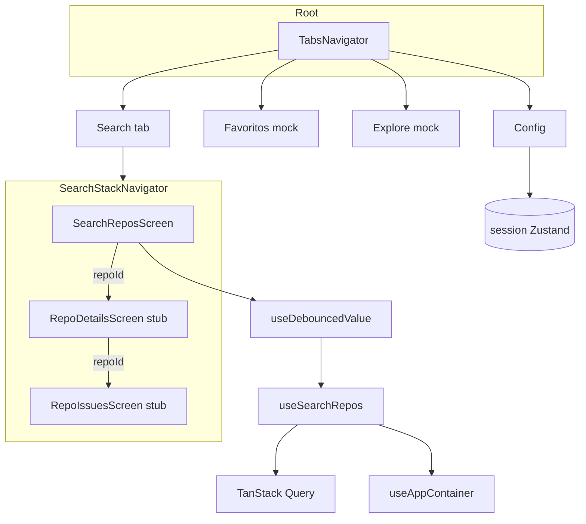

# Search & Navigation Design

**Spec**: `.specs/features/search-and-navigation/spec.md`  
**Context**: `.specs/features/search-and-navigation/context.md`  
**Status**: Approved (Approach A)

---

## Approach exploration (Large)

| Approach | Summary | Pros | Cons |
| -------- | ------- | ---- | ---- |
| **A — Tabs + Search nested stack (recommended)** | `TabsNavigator`: Search (stack), Favoritos, Explore, Config. Root = Tabs only (no Modal). Search stack owns list→details→issues. | Matches context; tabs ready for future; types clear | 4 tab icons now; mocks are thin |
| B — Root stack wraps everything | Root Stack: Tabs + Details + Issues as siblings | Simpler stack typing once | Details leave tab context; back UX messier with 4 tabs |
| C — Nested stack per tab | Each tab gets its own stack “for later” | Symmetric | Dead complexity for Favoritos/Explore/Config mocks |

**Recommendation: A.** Locked by context (B nested Search + 4 tabs + Config owns chrome).

---

## Architecture Overview



**Flow:** User types on Search → debounce hook → `useSearchRepos` → FlatList pages → row press → Details stub → Issues stub. Settings (fonte/tema) only on Config.

---

## Code Reuse Analysis

### Existing Components to Leverage

| Component | Location | How to Use |
| --------- | -------- | ---------- |
| `useSearchRepos` | `src/presentation/hooks/use-search-repos.ts` | List data / pages / error |
| `mapAppErrorToMessage` | `src/presentation/errors/` | Error copy |
| `useAppContainer` | `src/presentation/hooks/use-app-container.ts` | Optional `dataSource` indicator on Search |
| Session store | `src/stores/session-preferences-store.ts` | Config: `toggleMode`, `toggleDataSource` (or setters) |
| `InputField`, `Card`, `Header`, `Container`, `Button`, `Typography`, `Icon`, `Loading` | `src/components/ds/**` | Search UI + Config + mocks |
| `DataSourceLogo` | `src/components/ds/organisms` | Config data-source control |
| `AppThemeProvider` / hydrate | already in App | Unchanged |
| `AllTheProviders` / `render` | `src/test/render.tsx` | Screen tests |
| Fake repository | infrastructure | Injected via test helper |

### Integration Points

| System | Integration |
| ------ | ----------- |
| React Navigation | `@react-navigation/bottom-tabs` + `@react-navigation/native-stack` (already deps) |
| TanStack Query | Via existing presentation hooks |
| AsyncStorage | **Not** used for Favoritos in this feature (prefs only as today) |

---

## Components

### Navigation types

- **Purpose**: Typed param lists for tabs + Search stack.
- **Location**: `src/navigation/types.ts`
- **Interfaces**:
  - `TabsParamList`: `{ Search: undefined; Favoritos: undefined; Explore: undefined; Config: undefined }`
  - `SearchStackParamList`: `{ SearchRepos: undefined; RepoDetails: { repoId: string }; RepoIssues: { repoId: string } }`
  - Remove `Modal` from `RootStackParamList` — Root may collapse to `NavigationContainer` → `TabsNavigator` only (no outer stack), **or** keep a thin root with single `Tabs` screen. Prefer **Root = Tabs directly** inside `NavigationContainer` to delete Modal cleanly.
- **Dependencies**: React Navigation types
- **Reuses**: Current `types.ts` pattern

### `RootNavigator`

- **Purpose**: Theme-aware `NavigationContainer`; mount tabs (no Modal).
- **Location**: `src/navigation/RootNavigator.tsx`
- **Dependencies**: `TabsNavigator`, `useAppTheme`
- **Reuses**: Existing theme sync

### `TabsNavigator`

- **Purpose**: Four product tabs.
- **Location**: `src/navigation/TabsNavigator.tsx`
- **Screens**: `SearchStackNavigator`, `FavoritosScreen`, `ExploreScreen` (new product mock — **replace** Expo file), `ConfigScreen`
- **Reuses**: Tab bar theming from current file; swap `IconSymbol` for DS `Icon` where practical (agent discretion / debt note)

### `SearchStackNavigator`

- **Purpose**: Nested stack under Search tab.
- **Location**: `src/navigation/SearchStackNavigator.tsx` (new)
- **Screens**: `SearchReposScreen`, `RepoDetailsScreen`, `RepoIssuesScreen`
- **Options**: `headerShown` per screen — SearchRepos can use in-screen DS `Header`; stack header for Details/Issues stubs (native back) **or** custom Header — prefer **native stack header** on stubs for free back affordance; SearchRepos `headerShown: false` + DS Header title “Search”.

### `useDebouncedValue`

- **Purpose**: Generic debounce hook for string (or `T`).
- **Location**: `src/presentation/hooks/use-debounced-value.ts`
- **Interfaces**: `useDebouncedValue<T>(value: T, delayMs?: number): T` — default `SEARCH_DEBOUNCE_MS = 350` from `src/presentation/constants/`
- **Dependencies**: React `useState`/`useEffect`
- **Reuses**: None (new); export from presentation barrel

### `SearchReposScreen`

- **Purpose**: Product search UI.
- **Location**: `src/screens/search/SearchReposScreen.tsx` (folder `search/` optional — or `src/screens/SearchReposScreen.tsx`; prefer `src/screens/search/` + stubs colocated)
- **Behavior**: local `query` state → `useDebouncedValue` → `useSearchRepos`; FlatList `data={pages.flatMap}`; `onEndReached` → `fetchNextPage`; `RefreshControl` → `refetch`; states idle/loading/empty/error+Retry; `RepoListItem` press → navigate Details.
- **Dependencies**: presentation hooks, DS, navigation
- **Reuses**: Home chrome title pattern; **no** dataSource/theme toggles

### `RepoListItem`

- **Purpose**: Card row for one `Repo`.
- **Location**: `src/screens/search/RepoListItem.tsx` (screen-local) or `src/components/` only if reused — **screen-local** first
- **Interfaces**: `{ repo: Repo; onPress: (repoId: string) => void }`
- **Reuses**: `Card`, `Typography`

### `RepoDetailsScreen` / `RepoIssuesScreen` (stubs)

- **Purpose**: Typed stubs showing `repoId` + CTA Issues (Details only).
- **Location**: `src/screens/search/RepoDetailsScreen.tsx`, `RepoIssuesScreen.tsx`
- **Params**: `NativeStackScreenProps<SearchStackParamList, 'RepoDetails' | 'RepoIssues'>`

### Mock tabs

- **FavoritosScreen** — `src/screens/FavoritosScreen.tsx` — title + “Em breve” (AsyncStorage favoritos depois)
- **ExploreScreen** — replace Expo boilerplate at `src/screens/ExploreScreen.tsx` with product mock (“Repos em alta — em breve”)
- **ConfigScreen** — `src/screens/ConfigScreen.tsx` — sections: Data source (`DataSourceLogo` + toggle), Theme toggle, Token placeholder

### Delete / migrate

- Delete `ModalScreen.tsx` (+ tests if any)
- Replace `HomeScreen.tsx` → SearchRepos (migrate/remove); move TPH tests that asserted header toggles → **ConfigScreen** tests; Search gets new SRCH tests
- Clean `components/haptic-tab` / `IconSymbol` only if still used by tabs — keep if tabs still depend

### Constants

- `SEARCH_DEBOUNCE_MS = 350` in `src/presentation/constants/` (export barrel)

---

## Data Models

No new domain entities. Navigation params:

```typescript
type SearchStackParamList = {
  SearchRepos: undefined;
  RepoDetails: { repoId: string };
  RepoIssues: { repoId: string };
};

type TabsParamList = {
  Search: undefined;
  Favoritos: undefined;
  Explore: undefined;
  Config: undefined;
};
```

List flattening: `data = query.data?.pages.flatMap((p) => p.items) ?? []` (confirm `Page` shape from application — `items` / `repos` as in use case).

---

## Error Handling Strategy

| Scenario | Handling | User impact |
| -------- | -------- | ----------- |
| Search `AppError` / Query error | `mapAppErrorToMessage` + Retry → `refetch` | PT-BR message |
| Empty results | Empty state copy | Clear “nenhum repositório” |
| Empty query | Idle hint | No error flash |
| Missing optional repo fields | Omit / “—” | No crash |
| Mock tabs | No network | Static placeholder |

---

## Risks & Concerns

| Concern | Location | Impact | Mitigation |
| ------- | -------- | ------ | ---------- |
| HomeScreen tests couple to dataSource/theme toggles | `src/screens/__tests__/HomeScreen.test.tsx` | Break on move to Config | Rewrite as ConfigScreen tests; new SearchRepos tests for SRCH |
| Expo ExploreScreen is large boilerplate | `src/screens/ExploreScreen.tsx` | Confusion with product Explore | Replace file contents with thin mock; delete unused template imports |
| Tabs still use `IconSymbol` / HapticTab (template) | `TabsNavigator.tsx` | Inconsistent with DS | Prefer DS `Icon` in this feature if low-cost; else follow-up debt |
| Nested stack + tab focus | React Navigation | Deep links later | Standard nested pattern; no deep links this slice |
| Card not pressable by default | `Card.tsx` | Need Pressable wrapper | Wrap Card in `Pressable` / Button ghost in `RepoListItem` |

---

## Tech Decisions (feature-local)

| Decision | Choice | Rationale |
| -------- | ------ | --------- |
| Root shape | `NavigationContainer` → Tabs only (drop outer Modal stack) | Spec: no Modal |
| Debounce API | Generic `useDebouncedValue` + `SEARCH_DEBOUNCE_MS` | Reusable; user asked for dedicated hook |
| Search Header | Title only (+ optional read-only dataSource caption) | Config owns toggles |
| Stub headers | Native stack header + back | Free affordance |
| Favoritos persistence | Document only | Spec OOS |
| Screen folders | `src/screens/search/*` for stack; top-level mocks | Clear ownership |

### Project-level (→ STATE AD-026)

- Product IA: bottom tabs **Search | Favoritos | Explore | Config**; session chrome (fonte/tema) lives in **Config**; Search hosts nested repo stack.

---

## Testing strategy (for Tasks)

| Area | Tests |
| ---- | ----- |
| `useDebouncedValue` | fake timers unit |
| SearchReposScreen | idle / results / empty / error+Retry / endReached / refresh (Fake + Query) |
| ConfigScreen | toggles mutate store (migrate TPH) |
| Navigation | types smoke / navigate Details→Issues (RNTL NavigationContainer) |
| Mocks | render title + testID |

---

## Tips for Tasks / Execute

- Branch: `feat/search-and-navigation` from updated `main` or current presentation branch after merge.
- Do not implement Favoritos AsyncStorage or trending API.
- Do not add token SecureStore form — placeholder UI only.
