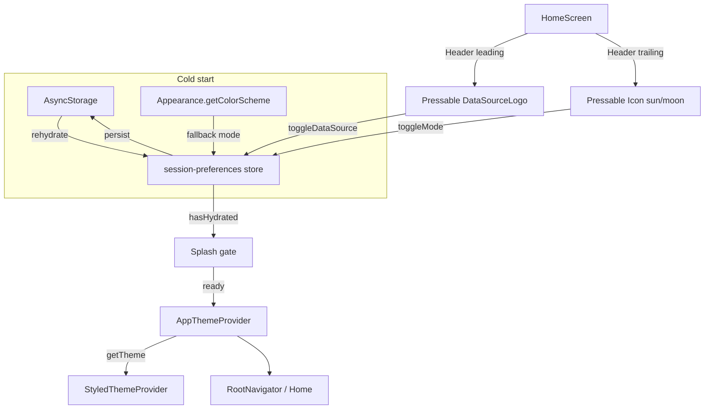

# Theme Persist + Home Header Design

**Spec**: `.specs/features/theme-persist-home/spec.md`  
**Context**: `.specs/features/theme-persist-home/context.md`  
**Status**: Approved

---

## Architecture Overview

Uma única store Zustand (`session-preferences`) é a **fonte de verdade** para `mode` + `dataSource`, com `persist` + AsyncStorage. `AppThemeProvider` deixa de ter `useState` paralelo: só (1) espera hidratação, (2) deriva `getTheme(mode, dataSource)` e (3) injeta no `StyledThemeProvider`. A Home compõe o `Header` com slots — logo pressable à esquerda, sol/lua à direita.



**Approach (locked by context):** single store + thin theme bridge + splash gate. Alternatives rejected: Context-only persist (não atende Zustand pedido); dois stores (overhead sem ganho nesta fatia).

---

## Code Reuse Analysis

### Existing Components to Leverage

| Component | Location | How to Use |
| --- | --- | --- |
| `Header` | `src/components/ds/molecules/Header/` | Layout `leading` \| title \| `trailing` — sem logo embutido |
| `DataSourceLogo` | `src/components/ds/organisms/DataSourceLogo/` | Leading pressable; lê `dataSource` do store/theme |
| `Icon` | `src/components/ds/atoms/Icon/` | Trailing: `moon-outline` / `sunny-outline` (Ionicons) |
| `Typography` / `Container` | DS atoms/molecules | Body shell mínimo da Home |
| `getTheme` / `ThemeMode` | `src/components/ds/theme/theme.ts` | Derivar tema a partir do store |
| `AppThemeProvider` / `useAppTheme` | `src/components/ds/theme/` | Refatorar: bridge + API estável |
| `DataSource` type | `src/domain/entities/data-source.ts` | Tipagem do store |
| AsyncStorage | `@react-native-async-storage/async-storage` | Já no `package.json` |
| `expo-splash-screen` | dependency | Manter splash até `hasHydrated` |
| `HomeScreen` | `src/screens/HomeScreen.tsx` | Substituir template Expo pelo shell Header |
| Test helpers | `src/test/render.tsx` | Seed mode/dataSource via store após mock Jest |

### Integration Points

| System | Integration Method |
| --- | --- |
| `App.tsx` | `SplashScreen.preventAutoHideAsync`; children só após hydrate (via provider) |
| Storybook / `STORYBOOK_ENABLED` | Entry Storybook pode `skipHydration` ou seed store; `initialMode`/`initialDataSource` props → `setState` |
| Jest | `__mocks__/zustand.ts` (docs oficiais) + storage em memória no persist |
| React Navigation themes | Após hydrate, preferir `mode` do store em vez de `useColorScheme()` solto no `RootNavigator`/`TabsNavigator` (evitar dessincronia) |

---

## Components

### session-preferences store

- **Purpose**: Fonte única tipada de `mode` + `dataSource` com persistência e reset oficial.
- **Location**: `src/stores/session-preferences-store.ts` (+ `index.ts` barrel se útil)
- **Interfaces**:
  - State: `{ mode: ThemeMode; dataSource: DataSource }`
  - `setMode(mode)`, `toggleMode()`, `setDataSource(ds)`, `toggleDataSource()`
  - `reset()` → `set(defaults)` + `useSessionPreferencesStore.persist.clearStorage()`
  - Persist: `name: 'searchrepos:session-preferences'`, `storage: createJSONStorage(() => AsyncStorage)`, `partialize: ({ mode, dataSource }) => ({ mode, dataSource })`
  - Defaults: `dataSource: 'github'`; `mode: Appearance.getColorScheme() === 'dark' ? 'dark' : 'light'`
  - Validação no merge/rehydrate: valores fora do enum → fallback defaults
- **Dependencies**: `zustand`, `zustand/middleware`, AsyncStorage, `Appearance`, domain `DataSource`, `ThemeMode`
- **Reuses**: AD-002 (única decisão de fonte), AD-010 (primary via theme)

### AppThemeProvider (bridge)

- **Purpose**: Gate de hidratação + injeção do tema styled; sem `useState` de prefs.
- **Location**: `src/components/ds/theme/AppThemeProvider.tsx` (refactor)
- **Interfaces**:
  - Props opcionais `initialMode` / `initialDataSource` (Storybook/tests): aplicam `setState` **antes** de pintar (e podem usar `skipHydration` + mark hydrated em test)
  - Lê `mode`/`dataSource` do store; `theme = useMemo(() => getTheme(...), [...])`
  - Enquanto `!persist.hasHydrated()` (hook `useHydration`): `return null` e **não** chama `SplashScreen.hideAsync`
  - Quando hydrated: `SplashScreen.hideAsync()` + render `StyledThemeProvider`
  - `useAppTheme()`: retorna `{ mode, setMode, toggleMode, dataSource, setDataSource }` a partir do store (API estável para DS/tests existentes)
- **Dependencies**: store, `getTheme`, splash-screen
- **Reuses**: API pública atual de `useAppTheme`

### useHydration (thin hook)

- **Purpose**: React-friendly `hasHydrated` via `onFinishHydration` / `hasHydrated()` (padrão FAQ Zustand).
- **Location**: `src/stores/use-hydration.ts` ou colado no provider
- **Interfaces**: `useHydration(): boolean`
- **Dependencies**: session store `.persist`
- **Reuses**: docs Zustand FAQ

### HomeScreen shell

- **Purpose**: Home inicial com Header de preferências.
- **Location**: `src/screens/HomeScreen.tsx`
- **Interfaces**:
  - `Header` title=`Search Repos`
  - `leading`: `Pressable` → `DataSourceLogo` → `toggleDataSource` (a11y: “Switch data source”)
  - `trailing`: `Pressable` → `Icon` `moon-outline` when `mode==='light'` else `sunny-outline` (próximo modo); a11y: “Switch to dark/light mode”
  - Body: `Container` tone background + opcional `Typography` mínima (sem lista)
- **Dependencies**: Header, DataSourceLogo, Icon, store / `useAppTheme`
- **Reuses**: Header slots; **não** importar SVG de marca

### Jest Zustand mock

- **Purpose**: Reset in-memory de todos os stores após cada teste.
- **Location**: `__mocks__/zustand.ts` (raiz do projeto; Jest auto-mock)
- **Interfaces**: Mock de `create` / `createStore` conforme [docs Testing → Jest](https://zustand.docs.pmnd.rs/learn/guides/testing#jest); `act` de `@testing-library/react-native`
- **Dependencies**: jest-expo setup já em `src/test/setup.ts`
- **Reuses**: padrão oficial; persist tests usam memory `StateStorage`

### Persist memory storage (tests)

- **Purpose**: Rehydrate/clearStorage sem AsyncStorage nativo.
- **Location**: `src/test/memory-storage.ts` (ou inline no teste do store)
- **Interfaces**: `StateStorage` in-memory + helper para `createJSONStorage(() => memory)`
- **Dependencies**: zustand middleware types

---

## Data Models

```typescript
type ThemeMode = 'light' | 'dark'; // existente em theme.ts
type DataSource = 'github' | 'gitlab'; // domain

type SessionPreferencesState = {
  mode: ThemeMode;
  dataSource: DataSource;
  setMode: (mode: ThemeMode) => void;
  toggleMode: () => void;
  setDataSource: (dataSource: DataSource) => void;
  toggleDataSource: () => void;
  reset: () => void;
};

type SessionPreferencesPersisted = Pick<SessionPreferencesState, 'mode' | 'dataSource'>;
```

**Relationships**: Store → `getTheme(mode, dataSource)` → DS tokens/primary (AD-010). Domain `DataSource` permanece puro.

---

## Error Handling Strategy

| Error Scenario | Handling | User Impact |
| --- | --- | --- |
| AsyncStorage read fail / empty | Defaults: system `mode`, `dataSource: 'github'`; mark hydrated | App abre com tema do sistema |
| JSON inválido / enum desconhecido | Ignorar persistido; mesmos defaults | Sem crash; tema sistema |
| AsyncStorage write fail | Estado em memória prevalece; próximo boot pode cair no fallback | Sessão atual ok; preferência pode não sobreviver |
| Splash nunca esconde (hydrate hang) | `onFinishHydration` + error path em `onRehydrateStorage` sempre libera gate | Worst case: defaults após erro |

---

## Risks & Concerns

| Concern | Location | Impact | Mitigation |
| --- | --- | --- | --- |
| `AppThemeProvider` mistura theme + dataSource em Context | `AppThemeProvider.tsx` | Fonte de verdade duplicada pós-Zustand | Remover `useState`; Context/`useAppTheme` só espelha store |
| Nav ainda usa `useColorScheme()` do sistema | `RootNavigator.tsx`, `TabsNavigator.tsx` | Tabs/stack tema ≠ store após toggle | Ligar nav theme ao `mode` do store nesta feature |
| Home template Expo com StyleSheet solto | `HomeScreen.tsx` | Viola AD-012 no produto | Reescrever shell com DS (`Header` + `Container`) |
| Persist + Jest mock: `getInitialState` vs rehydrate async | novo store | Testes flaky / estado sujo | Memory storage + mock oficial + asserts após `rehydrate()` |
| `useAppTheme` consumers em testes DS | vários `__tests__` | Quebra se API mudar | Manter shape de `useAppTheme`; seed via props/`setState` |
| Storybook entry bypass App hydrate | `App.tsx` Storybook branch | OK se Storybook não usa splash gate | Seed store no preview se necessário |

---

## Tech Decisions

| Decision | Choice | Rationale |
| --- | --- | --- |
| Onde mora o store | `src/stores/` (presentation/session) | Fora de `domain/`; prefs de UI/sessão (user rule Zustand) |
| Um store | `session-preferences` único | Spec assumption; AD-002 single decision point |
| Ícone tema | Próximo modo: light→`moon-outline`, dark→`sunny-outline` | Discuss agent preference |
| Gate | `expo-splash-screen` até `hasHydrated` | Spec “Espera”; dep já no projeto |
| `useAppTheme` | Thin wrapper do store (API estável) | Não quebrar DS tests/stories |
| Jest mock path | `__mocks__/zustand.ts` na raiz | Auto-mock Jest + docs oficiais |
| Project-level | **AD-018** — session prefs em Zustand+persist; ThemeProvider = bridge | Futuras features (Query invalidation) leem a mesma store |

---

## Requirement mapping (Design)

| ID | Design coverage |
| --- | --- |
| TPH-01 | Store API + `reset()` |
| TPH-02 | persist + AsyncStorage + partialize |
| TPH-03 | rehydrate restore |
| TPH-04 | Appearance fallback |
| TPH-05–06 | splash gate + AppThemeProvider bridge |
| TPH-07–10 | HomeScreen Header composition |

**Coverage:** 10/10 mapped at design level ⚠️ tasks ainda Pending
